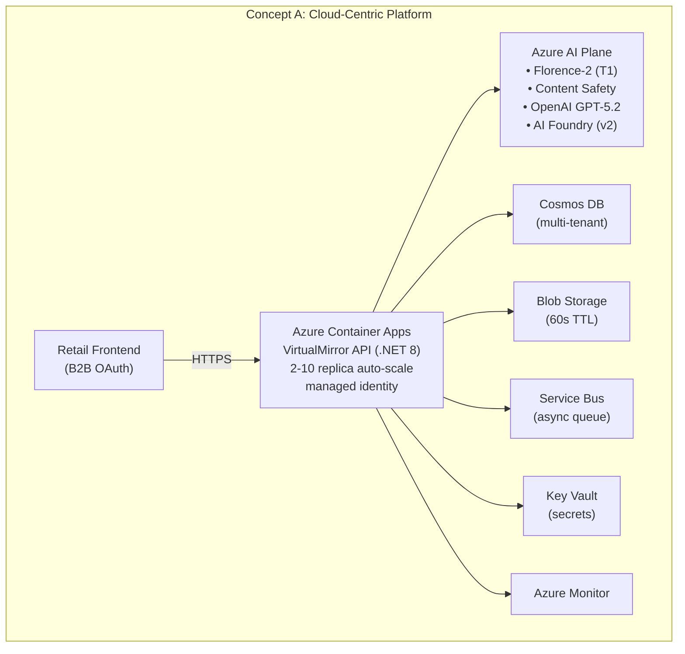
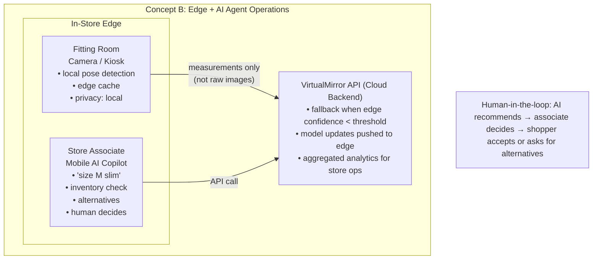
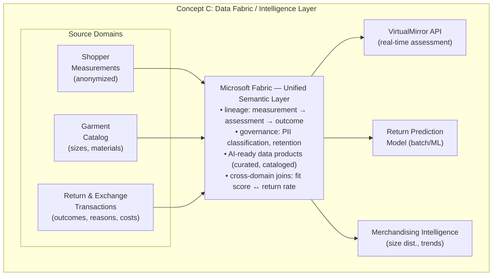

# Deliverable 1 | Three Architecture Concept Diagrams

**Industry**: Retail — Online Apparel
**Use case**: AI Clothing Fit Assessment Agent
**Date**: 2026-05-14
**Status**: Workshop deliverable

> *Show how agentic AI transforms workflows, decisions, safety, reliability, or optimization — appropriate to your industry.*

---

## Industry Context

Online apparel returns run at **25–40%**, and the dominant driver is fit uncertainty. Shoppers cannot judge how a garment will fit before purchasing, so they over-order, return, and lose trust. Returns are a margin killer (logistics, restocking, write-offs) and a sustainability problem (transport emissions, landfill apparel).

**Walmart-specific reality**: Walmart is the 3rd-largest U.S. apparel e-commerce retailer ($14.7B online apparel revenue, 2024). With an estimated 24–26% online clothing return rate and 53% of those driven by fit/sizing issues, the annual cost of fit-related returns runs into hundreds of millions. Walmart already invested in **Zeekit** (virtual try-on / visualization) — VirtualMirror complements this with **measurement-based fit confidence** ("will it fit?" vs "how does it look?"). The architecture integrates with Walmart's multi-hybrid cloud (Azure is a strategic partner at $500M+ annual spend), their Kubernetes-native internal developer platform, and existing catalog/PIM systems managed by Walmart Global Tech's 25,000+ engineering organization.

The three architecture concepts below show **how agentic AI transforms the retail value chain** — from the shopper's purchase decision, to the in-store associate's recommendation, to the merchandiser's catalog and inventory strategy — while keeping **humans accountable** for the final decision in every loop.

| Dimension                  | Where agentic AI transforms it                                                                     |
|----------------------------|----------------------------------------------------------------------------------------------------|
| **Workflows**              | Shoppers stop hunting size charts; associates stop chasing size runs; merchandisers stop guessing  |
| **Decisions**              | Fit recommendations are confidence-scored, per-area, and explainable — not a single number         |
| **Safety**                 | Photos purged in < 60s; opaque IDs; content safety filtering; biometric data never leaves the edge |
| **Reliability**            | Three-tier AI pipeline with graceful degradation; circuit breakers; 99.9% availability SLO         |
| **Optimization**           | 20–30% reduction in fit-driven returns; better size curves; less overstock; lower emissions        |

Anchoring artifacts: [Problem statement](docs/Sessions/Problem-statement.md) · [Product definition](docs/Sessions/Product-definition.md) · [Solution architecture](docs/architecture/solution-architecture.md) · [Risk register](docs/architecture/risk-register.md)

---

## A. Cloud-Centric Platform Architecture

> Modern data foundation, scalable services, governed AI/ML platform, integration backbone.

This is the **primary v1 implementation concept** — a cloud-native, multi-tenant API service on Azure with managed AI services, serverless container hosting, and zero-secret access via Managed Identity. The shopper's storefront calls a single API and gets back a confidence-scored fit recommendation in under five seconds.

### How agentic AI transforms the shopper's workflow

> "An AI copilot that assists the **online shopper** by synthesizing **a single photo and self-reported height into body measurements**, flagging **low-confidence predictions and poor fit areas**, and recommending **the best size with per-area fit breakdown** — while the **shopper retains accountability** for the purchase decision."

| Dimension        | Concept A capability                                                                                                  |
|------------------|------------------------------------------------------------------------------------------------------------------------|
| **Workflow**     | Fit assessment embedded in the product detail page — no separate tool, no app install, no size chart hunting          |
| **Decision**     | 5-point fit scale per body area (chest, waist, hips, inseam, shoulders) + overall recommendation + confidence score   |
| **Safety**       | Photo purged within 60s (TTL + explicit delete); opaque `shopperRef`; Content Safety filter; no biometrics persisted  |
| **Reliability**  | Three-tier AI pipeline (Florence-2 → GPT-5.2 → Foundry) with confidence gating; degrades to size-chart fallback on failure |
| **Optimization** | Target: 20–30% reduction in fit-driven returns; $2–6M annual savings for a mid-size retailer; < 5s p95 latency        |

### Tradeoffs

- **Gain**: Fastest time-to-market, lowest ops burden, fully managed services, API-first integration with any storefront
- **Accept**: Azure vendor lock-in; single-region v1; cloud network dependency; measurement accuracy band of ±2–4 cm

Full detail: [solution-architecture.md § Concept A](docs/architecture/solution-architecture.md#concept-a-cloud-centric-platform-architecture)

---

## B. Edge + AI Agent-Enabled Operations

> Decisioning at the edge, agentic workflows, human-in-the-loop control, latency- and safety-aware patterns.

This concept extends the platform into **in-store and real-time scenarios** — fitting rooms, kiosks, and associate-mobile apps. Pose detection and measurement extraction run on the edge device so raw body images never traverse the network. The cloud backend is invoked only when edge confidence drops below threshold, and a **store associate stays in the loop** before any recommendation reaches the shopper.

### How agentic AI transforms the store associate's workflow

> "An AI copilot that assists the **store associate** by synthesizing **real-time shopper measurements and inventory data**, flagging **fit issues before the shopper tries the garment on**, and recommending **alternative sizes and similar-fit items in stock** — while the **associate retains accountability** for styling advice."

| Dimension        | Concept B capability                                                                                                            |
|------------------|---------------------------------------------------------------------------------------------------------------------------------|
| **Workflow**     | Associate sees "this shopper needs a Size M slim — try also style #245 in M and #312 in L" on a mobile device before try-on     |
| **Decision**     | Pre-filtered try-on set + alternatives; associate uses judgment, shopper preference, and brand fit knowledge to finalize advice |
| **Safety**       | **Strongest privacy posture**: raw images never leave the kiosk; only derived measurements are transmitted; HITL gate on advice |
| **Reliability**  | Edge-first inference reduces cloud dependency; offline mode keeps fitting rooms working through WAN outages                     |
| **Optimization** | Less time on size runs, more time on relationship selling; lower per-assessment cloud cost; faster fitting-room turn time       |

### Tradeoffs

- **Gain**: Strongest privacy (local processing), lower cloud cost per assessment, in-store applicability, offline resilience
- **Accept**: Device fleet management; model distribution and version drift complexity; hardware capex per store

Full detail: [solution-architecture.md § Concept B](docs/architecture/solution-architecture.md#concept-b-edge--ai-agent-enabled-operations)

---

## C. Data Fabric / Intelligence Layer

> Unified semantic layer, lineage + governance, AI-ready data products powering decisions across domains.

This concept positions fit assessment data as part of a **unified retail intelligence layer** in Microsoft Fabric. Measurement profiles, garment catalog, and return/exchange transactions are joined under a governed semantic model with full lineage, so the same trusted dataset powers the real-time API, batch return-prediction models, and merchandiser dashboards.

### How agentic AI transforms the merchandiser's workflow

> "An AI copilot that assists the **merchandising analyst** by synthesizing **fit assessment outcomes, return data, and size distribution trends**, flagging **garments with high return-due-to-fit rates**, and recommending **size chart adjustments and inventory rebalancing** — while the **analyst retains accountability** for catalog decisions."

| Dimension        | Concept C capability                                                                                                       |
|------------------|----------------------------------------------------------------------------------------------------------------------------|
| **Workflow**     | Automated drift alerts: "Style #245 fit-confidence drops below 70% — proposed size chart correction attached"              |
| **Decision**     | Cross-domain joins close the loop: assessment confidence ↔ actual return reason ↔ next-cycle size curve                    |
| **Safety**       | Full lineage from raw measurement → assessment → return outcome; PII classification labels; GDPR Article 30 evidence       |
| **Reliability**  | One governed source of truth for AI, BI, and operational reporting — no shadow datasets, no drift between models           |
| **Optimization** | Returns become a strategic signal (not a cost center): better size curves, fewer overstocks, lower transport emissions     |

### Tradeoffs

- **Gain**: Strategic data asset; cross-domain insights; AI and BI operate on the same governed data
- **Accept**: Significant Microsoft Fabric investment; data engineering effort beyond the fit assessment scope; longer time-to-value

Full detail: [solution-architecture.md § Concept C](docs/architecture/solution-architecture.md#concept-c-data-fabric--intelligence-layer)

---

## Concept Comparison

| Aspect                    | A. Cloud-Centric Platform                     | B. Edge + AI Agent                                | C. Data Fabric / Intelligence Layer            |
|---------------------------|-----------------------------------------------|---------------------------------------------------|-------------------------------------------------|
| **Primary user**          | Online shopper                                | Store associate (HITL) + shopper                  | Merchandiser, data scientist                    |
| **Where AI runs**         | Azure managed services                        | On-device + cloud fallback                        | Cloud (real-time + batch on Fabric)             |
| **Human accountability**  | Shopper decides to buy                        | Associate decides what to recommend               | Analyst decides catalog & inventory changes     |
| **Latency profile**       | < 5s p95, network bound                       | Sub-second on edge; cloud only on low confidence  | Real-time + batch; insight latency hours–days   |
| **Privacy posture**       | Strong — 60s TTL, opaque refs                 | **Strongest** — raw images never leave the device | Strong — full lineage + PII classification      |
| **Time to value**         | **Months** (v1 today)                         | 1–2 years (device fleet, model distribution)      | 1–2 years (Fabric build-out, source onboarding) |
| **Capex profile**         | Low — managed services, pay-per-use           | Higher — store hardware                           | Higher — Fabric capacity + data engineering     |
| **Return-rate impact**    | 20–30% reduction (direct)                     | Incremental — improves in-store conversion        | Compounding — improves the catalog itself       |
| **Vendor lock-in risk**   | High (Azure)                                  | Medium (edge runtime portable)                    | High (Microsoft Fabric)                         |
| **AI failure mode**       | Graceful degrade to size chart                | Graceful degrade to associate judgment            | Stale data falls back to last good snapshot     |

---

## Recommended Sequencing

1. **Now (v1) — Build Concept A.** Ship the cloud-centric API. Prove the 20–30% return-rate reduction, validate confidence thresholds, and build the audit trail. Concept A is implementation-ready today.
2. **Next (v1.5) — Layer Concept C onto Concept A.** Land assessment outcomes and return transactions in Microsoft Fabric so the merchandising loop closes. Same governed data powers both real-time API and batch analytics.
3. **Later (v2) — Extend with Concept B for physical retail.** Once edge model footprint is small enough and store device strategy is clear, push inference to in-store kiosks for the strongest privacy posture and the in-store associate copilot.

The three concepts are **complementary, not exclusive** — they form a sequenced transformation roadmap: Cloud → Insight → Edge.

---

## Source Artifacts

| Artifact                         | Path                                                                                              |
|----------------------------------|---------------------------------------------------------------------------------------------------|
| Problem statement                | [docs/Sessions/Problem-statement.md](docs/Sessions/Problem-statement.md)                          |
| Product definition               | [docs/Sessions/Product-definition.md](docs/Sessions/Product-definition.md)                        |
| Solution architecture (full)     | [docs/architecture/solution-architecture.md](docs/architecture/solution-architecture.md)          |
| Canonical diagrams (ASCII)       | [docs/architecture/diagrams.md](docs/architecture/diagrams.md)                                    |
| Canonical diagrams (Mermaid)     | [docs/architecture/diagrams-mermaid.md](docs/architecture/diagrams-mermaid.md)                    |
| Architecture decision register   | [docs/architecture/decision-register.md](docs/architecture/decision-register.md)                  |
| Risk register                    | [docs/architecture/risk-register.md](docs/architecture/risk-register.md)                          |
| AI feasibility research          | [docs/research/ai-fit-assessment-feasibility.md](docs/research/ai-fit-assessment-feasibility.md)  |
| Feature specification            | [specs/001-clothing-fit-assessment/spec.md](specs/001-clothing-fit-assessment/spec.md)            |
| API contract (OpenAPI)           | [specs/001-clothing-fit-assessment/contracts/openapi.yaml](specs/001-clothing-fit-assessment/contracts/openapi.yaml) |
