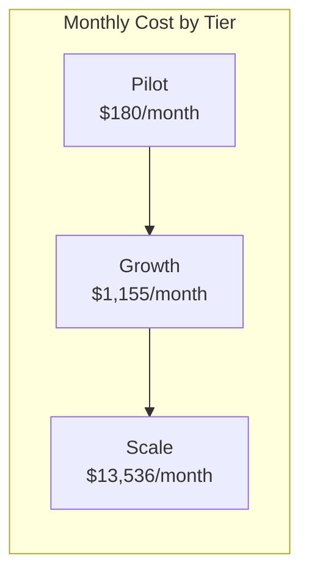

# VirtualMirror Azure Cost Estimate

**Version**: 1.0.0 | **Date**: 2026-05-14 | **Status**: Planning Estimate

---

## Table of Contents

- [Assumptions](#assumptions)
- [Usage Tiers](#usage-tiers)
- [Cost Breakdown by Service](#cost-breakdown-by-service)
- [Monthly Cost Summary](#monthly-cost-summary)
- [Annual Projections](#annual-projections)
- [Cost Optimization Opportunities](#cost-optimization-opportunities)
- [TCO Considerations](#tco-considerations)

---

## Assumptions

| Parameter | Value | Rationale |
|-----------|-------|-----------|
| Region | East US 2 | Walmart primary Azure region |
| Pricing model | Pay-as-you-go (PAYG) | Conservative; enterprise agreement discounts apply separately |
| Assessments per request | 1 photo + 1 height input → 1 fit result | Core transaction unit |
| Average image size | 2 MB | Smartphone camera JPEG (compressed) |
| GPT-5.2 tokens per assessment | ~1,500 input (image + prompt) + ~500 output | Structured output with measurements |
| Florence-2 calls per assessment | 1 (person detection + bounding box) | Tier 1 validation |
| Content Safety calls per assessment | 1 (image moderation) | Tier 1 validation |
| Cosmos DB RUs per assessment | ~10 RU (write) + ~5 RU (read) | Document operations |
| Average request duration | 3–5 seconds | End-to-end including AI calls |
| Container Apps vCPU allocation | 0.5 vCPU / 1 GiB per replica | Right-sized for I/O-bound workload |

---

## Usage Tiers

Three growth scenarios modeled from pilot through scale:

| Tier | Phase | Monthly Assessments | Concurrent Peak | Tenants | Timeline |
|------|-------|--------------------:|----------------:|--------:|----------|
| **Pilot** | MVP validation | 10,000 | 10 | 1–3 | Months 1–3 |
| **Growth** | Multi-tenant rollout | 100,000 | 50 | 5–10 | Months 4–9 |
| **Scale** | Production at Walmart volume | 1,000,000 | 500 | 20+ | Months 10+ |

---

## Cost Breakdown by Service

### Azure Container Apps (API Host)

| Component | Pilot | Growth | Scale |
|-----------|------:|-------:|------:|
| Min replicas | 2 | 2 | 2 |
| Max replicas | 3 | 5 | 10 |
| vCPU per replica | 0.5 | 0.5 | 1.0 |
| Memory per replica (GiB) | 1.0 | 1.0 | 2.0 |
| Active hours/month | 200 | 500 | 720 (always-on) |
| Idle hours/month | 520 | 220 | 0 |
| **Monthly cost** | **~$25** | **~$85** | **~$620** |

*Calculation*: Active vCPU-seconds × $0.000024 + idle × $0.000003 + GiB-seconds × $0.000003. Free grant (180K vCPU-sec) applied to Pilot.

---

### Azure OpenAI — GPT-5.2 Vision (Tier 2)

| Component | Pilot | Growth | Scale |
|-----------|------:|-------:|------:|
| Assessments | 10,000 | 100,000 | 1,000,000 |
| Input tokens (est.) | 15M | 150M | 1,500M |
| Output tokens (est.) | 5M | 50M | 500M |
| Input cost ($2.50/1M) | $37.50 | $375 | $3,750 |
| Output cost ($10.00/1M) | $50.00 | $500 | $5,000 |
| **Monthly cost** | **~$88** | **~$875** | **~$8,750** |

*Note*: GPT-5.2 pricing estimated at GPT-4o equivalent rates. Actual rates may differ; enterprise agreements typically include 10–30% discount. Provisioned Throughput Units (PTU) recommended at Scale tier for predictable pricing.

---

### Azure AI Foundry — Florence-2 (Tier 1)

| Component | Pilot | Growth | Scale |
|-----------|------:|-------:|------:|
| Inference calls | 10,000 | 100,000 | 1,000,000 |
| Estimated rate | ~$0.10/1K calls | ~$0.10/1K calls | ~$0.08/1K calls |
| **Monthly cost** | **~$1** | **~$10** | **~$80** |

*Note*: Florence-2 managed endpoint pricing is compute-based (VM backing the endpoint). For low volume, serverless pay-per-call is most cost-effective. At Scale tier, a dedicated managed endpoint ($0.37/hr for Standard_DS3_v2) may be more economical at ~$270/month but handles unlimited calls.

**Alternative at Scale**: Dedicated endpoint at ~$270/month (always-on) vs. $80/month serverless — choose based on latency requirements.

---

### Azure AI Content Safety (Tier 1)

| Component | Pilot | Growth | Scale |
|-----------|------:|-------:|------:|
| Image analyses | 10,000 | 100,000 | 1,000,000 |
| Rate | $0.75/1K images | $0.75/1K images | $0.75/1K images |
| Free tier (5K/month) | -$3.75 | — | — |
| **Monthly cost** | **~$4** | **~$75** | **~$750** |

---

### Azure Cosmos DB (Multi-Tenant Data Store)

| Component | Pilot | Growth | Scale |
|-----------|------:|-------:|------:|
| Max RU/s (autoscale) | 400 | 1,000 | 4,000 |
| Min billed RU/s (10%) | 40 | 100 | 400 |
| Avg utilized RU/s | 60 | 300 | 1,500 |
| Rate | $0.00012/RU/s/hr | $0.00012/RU/s/hr | $0.00012/RU/s/hr |
| Storage (GB) | 1 | 10 | 100 |
| Storage rate | $0.25/GB/month | $0.25/GB/month | $0.25/GB/month |
| **Monthly cost** | **~$7** | **~$30** | **~$156** |

*Calculation*: Avg RU/s × $0.00012 × 730 hours + storage. Autoscale premium (~1.5x manual) included.

---

### Azure Blob Storage (Transient Image Processing)

| Component | Pilot | Growth | Scale |
|-----------|------:|-------:|------:|
| Write operations | 10,000 | 100,000 | 1,000,000 |
| Delete operations | 10,000 | 100,000 | 1,000,000 |
| Data stored (transient, ~60s avg) | <0.1 GB | <0.5 GB | <5 GB |
| Write ops ($0.05/10K) | $0.05 | $0.50 | $5.00 |
| Data transfer | Negligible | Negligible | ~$5 |
| **Monthly cost** | **~$1** | **~$2** | **~$15** |

*Note*: Extremely low cost due to 60-second TTL — data is never stored long-term.

---

### Azure Service Bus (Async Queue)

| Component | Pilot | Growth | Scale |
|-----------|------:|-------:|------:|
| Base charge | $10 | $10 | $10 |
| Operations/month | <1M | ~5M | ~50M |
| Overage cost | $0 | $0 | ~$30 |
| **Monthly cost** | **~$10** | **~$10** | **~$40** |

*Note*: Service Bus only used when queue depth > 50 or p95 > 4s. Most requests are synchronous. At Scale, ~5% of requests may queue.

---

### Microsoft Entra ID (Authentication)

| Component | Pilot | Growth | Scale |
|-----------|------:|-------:|------:|
| App registrations | 3 | 10 | 20+ |
| Token validations | Included | Included | Included |
| **Monthly cost** | **$0** | **$0** | **$0** |

*Note*: No additional cost — included in Azure subscription. Entra ID P1/P2 features (conditional access) may be required at Scale (~$6/user/month for admins only).

---

### Azure Key Vault

| Component | Pilot | Growth | Scale |
|-----------|------:|-------:|------:|
| Secrets operations | ~5K | ~20K | ~100K |
| Rate ($0.03/10K operations) | $0.02 | $0.06 | $0.30 |
| **Monthly cost** | **~$1** | **~$1** | **~$1** |

---

### Azure App Configuration (Feature Flags)

| Component | Pilot | Growth | Scale |
|-----------|------:|-------:|------:|
| Standard tier | $1.20/day | $1.20/day | $1.20/day |
| **Monthly cost** | **~$36** | **~$36** | **~$36** |

---

### Azure Monitor (Observability)

| Component | Pilot | Growth | Scale |
|-----------|------:|-------:|------:|
| Log ingestion (GB/month) | 2 | 10 | 50 |
| Rate ($2.76/GB) | $5.52 | $27.60 | $138 |
| Retention (30 days included) | $0 | $0 | $0 |
| Alert rules (5–20) | $1.50 | $3.00 | $6.00 |
| **Monthly cost** | **~$7** | **~$31** | **~$144** |

---

### Azure DDoS Protection (Recommended)

| Component | Pilot | Growth | Scale |
|-----------|------:|-------:|------:|
| Network Protection plan | — | — | $2,944/month |
| **Monthly cost** | **$0** | **$0** | **~$2,944** |

*Note*: DDoS Protection Standard is expensive but recommended at Scale tier per threat model. Consider DDoS IP Protection ($199/month per public IP) as a cost-effective alternative.

**Alternative**: DDoS IP Protection at ~$199/month (single public IP) — sufficient for v1.

---

## Monthly Cost Summary

| Service | Pilot | Growth | Scale | % of Scale |
|---------|------:|-------:|------:|:----------:|
| Azure OpenAI (GPT-5.2) | $88 | $875 | $8,750 | 64.6% |
| Azure DDoS Protection | $0 | $0 | $2,944 | 21.7% |
| Content Safety | $4 | $75 | $750 | 5.5% |
| Container Apps | $25 | $85 | $620 | 4.6% |
| Cosmos DB | $7 | $30 | $156 | 1.2% |
| Azure Monitor | $7 | $31 | $144 | 1.1% |
| Florence-2 (AI Foundry) | $1 | $10 | $80 | 0.6% |
| Service Bus | $10 | $10 | $40 | 0.3% |
| App Configuration | $36 | $36 | $36 | 0.3% |
| Blob Storage | $1 | $2 | $15 | 0.1% |
| Key Vault | $1 | $1 | $1 | <0.1% |
| Entra ID | $0 | $0 | $0 | 0% |
| **TOTAL** | **$180** | **$1,155** | **$13,536** | **100%** |

### Cost per Assessment

| Tier | Monthly Cost | Assessments | Cost per Assessment |
|------|------------:|------------:|--------------------:|
| Pilot | $180 | 10,000 | **$0.018** |
| Growth | $1,155 | 100,000 | **$0.012** |
| Scale | $13,536 | 1,000,000 | **$0.014** |

*Note*: Scale tier includes DDoS Protection ($2,944 fixed). Without DDoS, cost per assessment at Scale drops to **$0.011**.

---

## Annual Projections

Assuming a 12-month ramp: 3 months Pilot → 6 months Growth → 3 months Scale.

| Phase | Duration | Monthly Cost | Subtotal |
|-------|----------|------------:|----------:|
| Pilot (months 1–3) | 3 months | $180 | $540 |
| Growth (months 4–9) | 6 months | $1,155 | $6,930 |
| Scale (months 10–12) | 3 months | $13,536 | $40,608 |
| **Year 1 Total** | 12 months | — | **$48,078** |

### Year 2 (Steady-State Scale)

| Scenario | Monthly | Annual |
|----------|--------:|-------:|
| Scale (1M assessments/month) | $13,536 | $162,432 |
| Scale with PTU discount (est. 25% on OpenAI) | $11,349 | $136,188 |
| Scale with enterprise agreement (est. 20% overall) | $10,829 | $129,946 |

---

## Cost Optimization Opportunities

| # | Optimization | Savings Potential | Effort | When |
|---|-------------|:-----------------:|--------|------|
| 1 | **Provisioned Throughput Units (PTU)** for GPT-5.2 at predictable volume | 20–40% on AI costs | Low | Scale tier |
| 2 | **Reserved capacity** for Cosmos DB (1-year commit) | 20% on DB costs | Low | Growth+ |
| 3 | **Profile reuse** — skip photo processing for returning shoppers with saved profiles | 30–50% fewer AI calls | Medium | Growth+ |
| 4 | **Response caching** — cache fit results for same garment+profile combination | 10–20% fewer AI calls | Medium | Scale |
| 5 | **DDoS IP Protection** instead of full Network Protection | $2,744/month savings | Low | Scale |
| 6 | **Spot/low-priority** for batch garment ingestion workloads | 60–80% on batch compute | Low | Growth+ |
| 7 | **Log sampling** in Azure Monitor (sample non-error traces at 10%) | 50–70% on logging costs | Low | Scale |
| 8 | **Florence-2 dedicated endpoint** at scale (always-on vs. per-call) | ~$200/month savings at 1M+ calls | Low | Scale |
| 9 | **Enterprise Agreement** pricing with Microsoft | 10–30% across all services | High (procurement) | Any |
| 10 | **Image compression** before upload (reduce token count for GPT-5.2) | 10–15% on AI input costs | Low | Pilot+ |

### Optimized Scale Estimate

With optimizations #1, #3, #5, and #7 applied:

| Service | Before | After | Savings |
|---------|-------:|------:|--------:|
| Azure OpenAI | $8,750 | $5,250 | $3,500 (PTU + profile reuse) |
| DDoS Protection | $2,944 | $199 | $2,745 (IP Protection) |
| Azure Monitor | $144 | $50 | $94 (log sampling) |
| Others | $1,698 | $1,698 | $0 |
| **TOTAL** | **$13,536** | **$7,197** | **$6,339 (47% reduction)** |

---

## TCO Considerations

Beyond Azure consumption, total cost of ownership includes:

| Category | Estimate (Annual) | Notes |
|----------|------------------:|-------|
| Azure consumption (Year 1) | $48,078 | As calculated above |
| Development team (2 FTE, 6 months) | $250,000–400,000 | .NET + AI/ML engineers |
| Security & compliance (pen testing, SOC 2 prep) | $30,000–50,000 | External vendor + internal |
| Ongoing operations (0.5 FTE SRE) | $75,000–100,000 | Post-launch monitoring, on-call |
| AI model validation & monitoring | $20,000–30,000 | Ground-truth dataset, bias auditing |
| **Year 1 TCO** | **$423,000–628,000** | |

### ROI Context

| Metric | Value |
|--------|-------|
| Walmart fit-return cost (estimated) | $200–400M/year |
| VirtualMirror target reduction | ≥20% (target 30%) |
| Potential annual savings | $40–120M |
| Year 1 TCO | ~$0.5M |
| **ROI multiple** | **80–240x** |

*Even at 1% effectiveness (reducing fit returns by just 1%), the system saves $2–4M/year against a $0.5M investment.*

---

## Pricing Sources & Disclaimers

- All prices are in USD and based on East US 2 region public pricing as of May 2026
- Enterprise Agreement (EA), CSP, or Walmart-specific contracted rates will differ (typically 10–30% lower)
- GPT-5.2 pricing estimated using published GPT-4o rates; actual GPT-5.2 rates may vary
- Florence-2 managed endpoint pricing is approximate pending GA pricing publication
- Prices exclude: network egress (minimal for API-only service), support plans, and Azure Reservation discounts
- This estimate should be validated against the [Azure Pricing Calculator](https://azure.microsoft.com/en-us/pricing/calculator/) for production planning

---

*Document maintained alongside [solution-architecture.md](./solution-architecture.md) and [threat-model.md](./threat-model.md).*
