# Mermaid Diagrams: AI Clothing Fit Assessment Agent

**Version**: 1.0.0 | **Date**: 2026-05-14 | **Status**: Reference

Mermaid renditions of the canonical architecture diagrams. Source: [diagrams.md](diagrams.md) and [solution-architecture.md](solution-architecture.md).

---

## 1. System Context

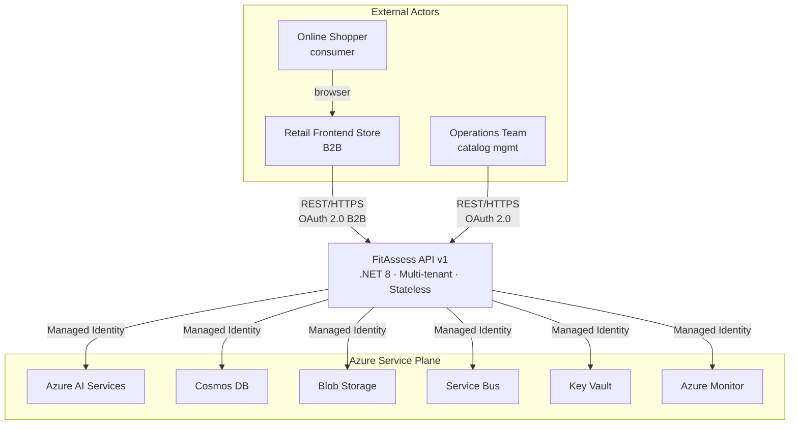

---

## 2. Container View — FitAssess API

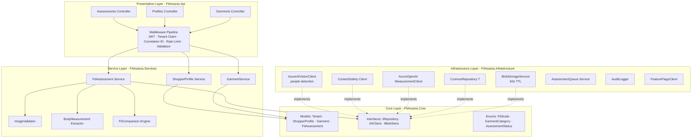

---

## 3. Three-Tier AI Pipeline

```mermaid
flowchart TB
    Input[Photo + HeightCm]

    subgraph "TIER 1 — Validation (parallel)"
        Vision[Azure AI Vision 4.0<br/>people detection · bounding box · multi-person reject]
        Safety[Azure AI Content Safety<br/>minor/age detection · inappropriate content]
        Defender[Defender for Storage<br/>malware scan]
        Local[Local Checks<br/>MIME type · size ≤10MB · luminance ≥40]
    end

    subgraph "TIER 2 — Measurement Extraction (v1)"
        GPT4o[Azure OpenAI GPT-4o Vision<br/>structured JSON output]
        Output2[shoulderWidth · chestCircumference<br/>waistCircumference · hipCircumference<br/>inseam · armLength · confidence · modelVersion]
    end

    subgraph "TIER 3 — Custom Model (v2 planned)"
        CustomModel[Custom SMPL Body Model<br/>Azure AI Foundry Endpoint<br/>±1-2 cm target accuracy]
    end

    FCE[FitComparisonEngine<br/>deterministic · Core layer]

    Input --> Vision
    Input --> Safety
    Input --> Defender
    Input --> Local
    Vision -->|PASS| GPT4o
    Safety -->|PASS| GPT4o
    Defender -->|PASS| GPT4o
    Local -->|PASS| GPT4o
    GPT4o --> Output2
    Output2 --> FCE
    GPT4o -.->|v2 replacement| CustomModel
    CustomModel -.-> FCE
```

---

## 4. Assessment Request Sequence

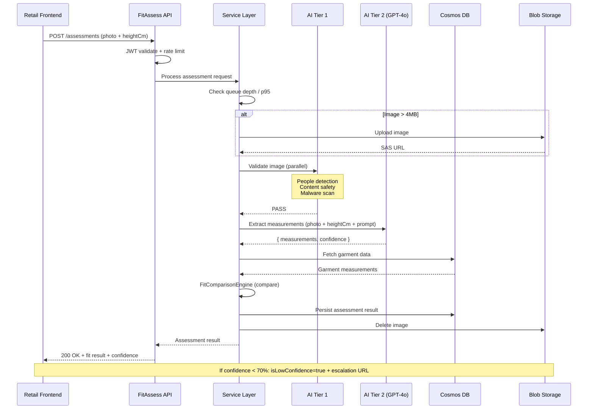

---

## 5. Multi-Tenant Data Architecture

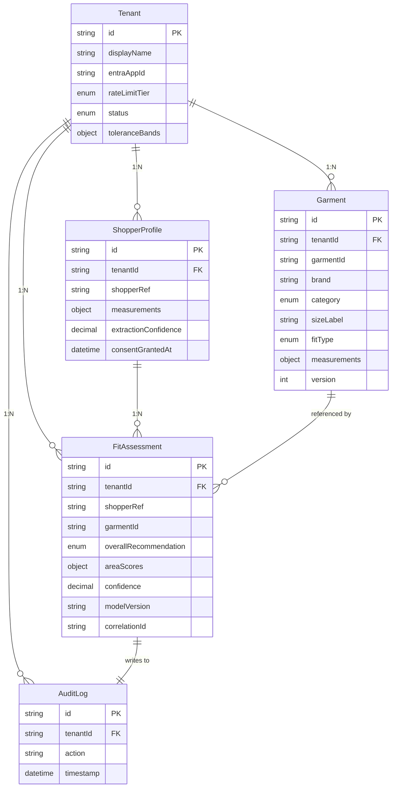

---

## 6. Network and Security Topology

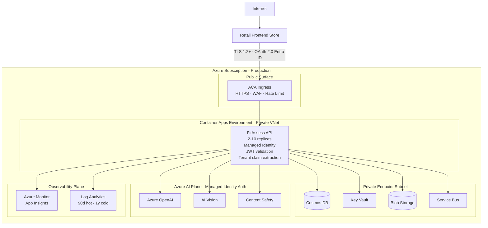

---

## 7. Deployment Topology

```mermaid
flowchart TB
    Repo[GitHub Repository<br/>main / feature branches]

    subgraph Dev Environment
        DevACA[ACA · 1 replica · Basic]
        DevCosmos[Cosmos DB · Free/Std]
        DevBlob[Blob Storage]
    end

    subgraph Staging Environment
        StagingACA[ACA · 2 replicas · Standard]
        StagingCosmos[Cosmos DB · Standard]
        StagingBlob[Blob Storage]
    end

    subgraph Production - West Europe
        subgraph AZ1[Availability Zone 1]
            ProdACA1[ACA replicas<br/>auto 2-10]
        end
        subgraph AZ2[Availability Zone 2]
            ProdACA2[ACA replicas<br/>auto 2-10]
        end
        subgraph AZ3[Availability Zone 3]
            ProdACA3[ACA replicas<br/>auto 2-10]
        end
        ProdCosmos[(Cosmos DB<br/>Autoscale 400-4000 RU/s<br/>continuous backup)]
        ProdBlob[(Blob Storage<br/>LRS · 60s lifecycle)]
        ProdSB[Service Bus · Standard]
        ProdKV[Key Vault · Standard]
    end

    Repo -->|GitHub Actions| Dev Environment
    Dev Environment -->|manual gate<br/>smoke tests| Staging Environment
    Staging Environment -->|manual prod gate| Production - West Europe
    ProdACA1 <--> ProdACA2
    ProdACA2 <--> ProdACA3
```

---

## 8. CI/CD Pipeline

```mermaid
flowchart LR
    subgraph Build & Test
        Lint[1. Lint & Format]
        Build[2. dotnet build]
        Unit[3. Unit Tests]
        Integ[4. Integration Tests<br/>Testcontainers]
        Contract[5. Contract Tests<br/>OpenAPI]
        Coverage[6. Coverage Gate<br/>≥80%/90%]
    end

    subgraph Security Scan
        SAST[7. SAST<br/>CodeQL/Semgrep]
        SCA[8. SCA<br/>dependency scan]
        SBOM[9. SBOM<br/>CycloneDX]
    end

    subgraph Container
        Docker[10. Container Build]
        Trivy[11. Trivy Scan +<br/>Notation Sign]
    end

    subgraph Deploy Staging
        BicepStg[12. Bicep Deploy<br/>what-if]
        DAST[13. DAST<br/>OWASP ZAP]
        E2E[14. E2E Smoke Tests]
    end

    subgraph Deploy Production
        BicepProd[15. Bicep Deploy<br/>Canary 10%]
        FeatureFlag[16. Progressive Rollout]
        Monitoring[17. Azure Monitor<br/>auto-rollback on SLO breach]
    end

    Lint --> Build --> Unit --> Integ --> Contract --> Coverage
    Coverage --> SAST --> SCA --> SBOM
    SBOM --> Docker --> Trivy
    Trivy -->|manual gate| BicepStg --> DAST --> E2E
    E2E -->|manual gate| BicepProd --> FeatureFlag --> Monitoring
```

---

## 9. Concept A — Cloud-Centric Platform

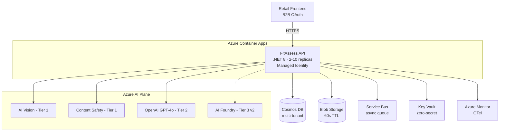

---

## 10. Concept B — Edge + AI Agent Operations

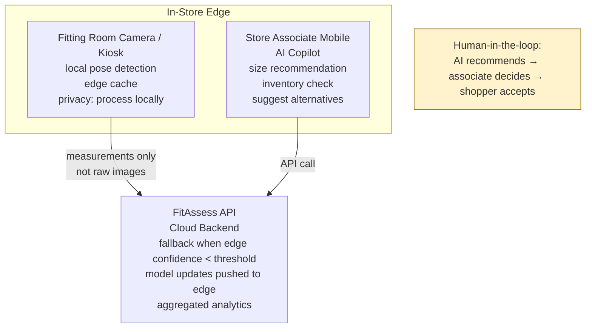

---

## 11. Concept C — Data Fabric / Intelligence Layer

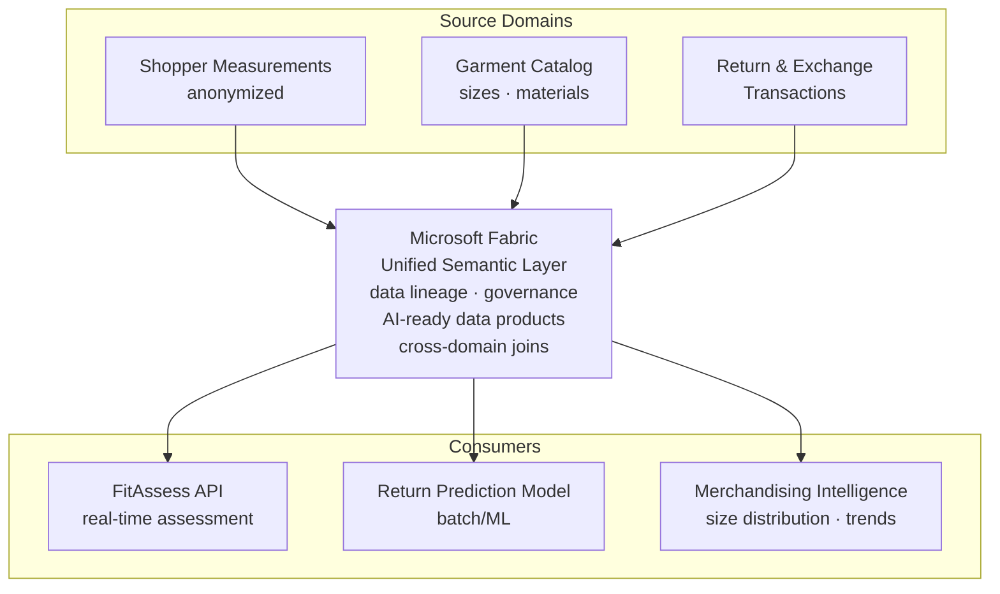

---

## 12. Fit Assessment Domain Flow

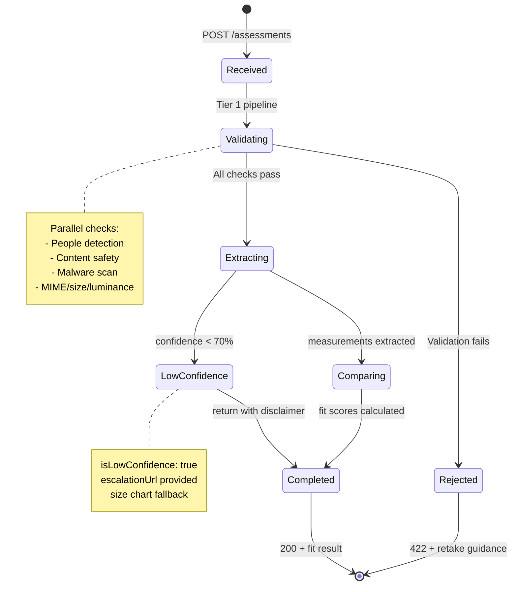

---

## Diagram Sources

These Mermaid diagrams are derived from:

- [diagrams.md](diagrams.md) — ASCII reference diagrams
- [solution-architecture.md](solution-architecture.md) — system narrative and concept descriptions
- [data-model.md](../../specs/001-clothing-fit-assessment/data-model.md) — entity schemas
- [plan.md](../../specs/001-clothing-fit-assessment/plan.md) — project structure
