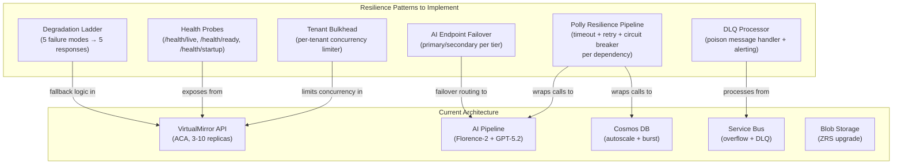

## Executive Summary

This review assesses the VirtualMirror AI Clothing Fit Assessment architecture from a resiliency and availability standpoint. The system targets 99.9% monthly availability with a single-region Azure deployment serving 500 concurrent assessments through a three-tier AI pipeline.

**Overall assessment**: The architecture has a solid foundation (multi-AZ compute, Cosmos DB continuous backup, Service Bus overflow) but contains critical gaps in AI service redundancy, retry policy specification, and tenant isolation that must be addressed before production launch.

| Severity | Finding Count |
|----------|--------------|
| Critical | 1 |
| High | 2 |
| Medium | 4 |
| Low | 3 |

---

## Current Posture

| Aspect | Current State | Assessment |
|--------|--------------|------------|
| Availability SLO | 99.9% monthly (~8.7h downtime) | Aspirational given single-region |
| RTO / RPO | 30 min / 1 hour | Single-region complicates RTO guarantee |
| Compute redundancy | Multi-AZ, 2–10 replicas (ACA) | Good within-region |
| Data redundancy | Cosmos DB continuous backup | Good |
| Storage redundancy | Blob Standard LRS | Gap — no zone redundancy |
| AI service redundancy | None documented | Critical gap |
| Overflow handling | Service Bus queue at depth > 50 | Good pattern, sparse detail |
| Retry/timeout policies | Mentioned, not specified | Gap |

### Composite Availability Estimate

With six services in series (ACA, Cosmos DB, Azure OpenAI, Florence-2, Content Safety, Service Bus), each at ~99.95% individual availability:

$$A_{composite} \approx 0.9995^6 \approx 99.7\%$$

This falls below the stated 99.9% SLO without redundancy measures.

---

## Findings

### F-001: AI Pipeline Single Point of Failure

| Field | Value |
|-------|-------|
| **Severity** | CRITICAL |
| **Category** | Availability |
| **Affected Components** | Florence-2 endpoint, Azure OpenAI GPT-5.2, Content Safety |

**Description**: The three-tier AI pipeline has no documented failover. Each AI service is a single managed endpoint. An Azure OpenAI regional outage brings assessment creation to zero — the entire value proposition is unavailable.

**Evidence**: Solution architecture shows single endpoint references for each AI tier. No secondary deployment or failover logic documented.

**Recommendations**:

1. Deploy GPT-5.2 in a **secondary Azure OpenAI resource** (same or paired region) behind a priority-based failover client. Use the Azure OpenAI load balancer pattern or a primary/secondary with health-check switching.
2. Deploy a **second Florence-2 managed endpoint** (warm standby or active-active) behind the `IImageValidator` abstraction.
3. Content Safety: accept graceful degradation on outage (skip content safety with alert + manual review queue) or deploy a secondary resource.

**Impact if unaddressed**: Complete service outage during any AI dependency failure. Estimated exposure: 2–4 hours per incident based on Azure AI service incident history.

---

### F-002: No Retry or Timeout Policies Specified

| Field | Value |
|-------|-------|
| **Severity** | HIGH |
| **Category** | Fault Tolerance |
| **Affected Components** | All external service calls |

**Description**: The architecture mentions circuit breakers but does not specify retry policies, timeout budgets, or jitter strategies for the three external AI calls and Cosmos/Service Bus operations. Without explicit timeouts, a hung AI endpoint can exhaust thread pool and cascade across all requests.

**Recommended Polly v8 resilience configuration**:

| Dependency | Timeout | Retries | Circuit Breaker |
|-----------|---------|---------|-----------------|
| Florence-2 | 3s | 2 retries, exponential + jitter | Open after 5 failures in 30s, half-open at 15s |
| Content Safety | 2s | 1 retry | Open after 5 failures in 30s |
| GPT-5.2 Vision | 8s | 1 retry (idempotent only) | Open after 3 failures in 60s |
| Cosmos DB | 5s | 3 retries (SDK built-in) | N/A (SDK handles) |
| Service Bus | 3s | 3 retries, exponential | Open after 10 failures in 60s |

**End-to-end budget**: Set a request-level timeout of 12s. If total elapsed exceeds threshold, return degraded response early rather than allowing individual retries to cascade past the 5s SLO.

---

### F-003: No Bulkhead Isolation Between Tenants

| Field | Value |
|-------|-------|
| **Severity** | HIGH |
| **Category** | Isolation / Noisy Neighbor |
| **Affected Components** | API layer, AI pipeline quota |

**Description**: Rate limiting exists per tenant tier, but no bulkhead prevents one tenant's traffic spike from consuming all replicas or starving AI service quota for other tenants.

**Recommendations**:

1. Implement **per-tenant concurrency limiters** (`System.Threading.SemaphoreSlim` per tenant or Polly `BulkheadPolicy`) to cap concurrent AI pipeline calls per tenant.
2. Partition Azure OpenAI deployments by tier (premium tenants get dedicated PTU deployment; standard tenants share token-based deployment).
3. In Service Bus, use **per-tenant queues or sessions** so one tenant's overflow backlog doesn't block others.

---

### F-004: Blob Storage Uses LRS — No Zone Redundancy

| Field | Value |
|-------|-------|
| **Severity** | MEDIUM |
| **Category** | Data Durability |
| **Affected Components** | Azure Blob Storage (transient image processing) |

**Description**: Blob Storage is Standard LRS. While images are transient (60s TTL), an availability zone failure during processing means in-flight images are lost with no retry path.

**Recommendations**:

1. Upgrade to **ZRS (Zone-Redundant Storage)** for the processing container. Cost difference is minimal for transient data.
2. Alternatively, implement an **in-memory retry**: if Blob read fails after upload, the original image bytes are still in the request pipeline — retry from memory rather than re-reading Blob.

---

### F-005: No Health Check Differentiation

| Field | Value |
|-------|-------|
| **Severity** | MEDIUM |
| **Category** | Orchestration |
| **Affected Components** | `/api/v1/health` endpoint, ACA probes |

**Description**: A single `/api/v1/health` endpoint exists. ACA needs separate liveness, readiness, and startup probes for proper orchestration during deployments and dependency outages.

**Recommendations**:

| Probe | Path | Purpose | Checks |
|-------|------|---------|--------|
| Liveness | `/health/live` | Is the process alive? | Returns 200 if process runs (no dependency checks) |
| Readiness | `/health/ready` | Can it serve traffic? | Cosmos DB, Azure OpenAI, Florence-2 reachable |
| Startup | `/health/startup` | Has cold start completed? | Longer timeout for AI SDK client initialization |

When readiness fails, ACA stops routing traffic to that replica without killing it — preventing restart loops during dependency outages.

---

### F-006: Graceful Degradation Underspecified

| Field | Value |
|-------|-------|
| **Severity** | MEDIUM |
| **Category** | User Experience / Availability |
| **Affected Components** | API response handling |

**Description**: The architecture mentions "degrade gracefully to size chart fallback" but doesn't define partial degradation tiers. Different failure modes should produce different user experiences.

**Recommended degradation ladder**:

| Failure Mode | Degradation Response | User Experience |
|-------------|---------------------|-----------------|
| GPT-5.2 unavailable | Return cached profile measurements + fit comparison | "Based on your saved measurements" |
| Florence-2 unavailable | Skip person detection; proceed with GPT-5.2 (higher risk of bad images) | Transparent to user; moderation queue alert |
| Content Safety unavailable | Queue image for async safety review; proceed | No user impact; ops reviews queue |
| Cosmos DB unavailable | Reject with 503 + `Retry-After` header | "Service temporarily unavailable" |
| All AI unavailable | Return size chart redirect + cached garment data | "Try our size guide instead" |

---

### F-007: Auto-Scale Configuration Gaps

| Field | Value |
|-------|-------|
| **Severity** | MEDIUM |
| **Category** | Elasticity |
| **Affected Components** | Azure Container Apps scaling rules |

**Description**: Scale rules are "2–10 replicas" with threshold at 50 concurrent HTTP requests. No pre-warming, scale-in stabilization, or scheduled scaling is documented.

**Recommendations**:

1. Set **minimum replicas to 3** (not 2) to ensure each AZ always has at least one healthy replica.
2. Set **scale-in stabilization window to 5 minutes** to prevent flapping during bursty traffic.
3. Add a **KEDA HTTP scaler** with `target: 25` concurrent connections per replica (gives headroom before 50).
4. Implement **scheduled scaling** for known peaks (Black Friday: pre-warm to 6+ replicas 2 hours before).
5. Consider **scale-to-zero prevention** — a minimum of 3 ensures no cold-start latency.

---

### F-008: Dead Letter Queue Handling Missing

| Field | Value |
|-------|-------|
| **Severity** | LOW |
| **Category** | Message Processing |
| **Affected Components** | Azure Service Bus overflow queue |

**Description**: Service Bus is used for overflow queuing, but no DLQ processing or poison message handling is documented. Failed messages silently accumulate.

**Recommendations**:

1. Configure **max delivery count = 3** with exponential backoff between attempts.
2. Process DLQ messages via a background job that logs failures, alerts ops, and optionally retries with a longer timeout.
3. Alert when DLQ depth > 10 messages in 5 minutes.

---

### F-009: Cosmos DB RU Saturation Under Burst

| Field | Value |
|-------|-------|
| **Severity** | LOW |
| **Category** | Throughput |
| **Affected Components** | Cosmos DB autoscale (400–4000 RU/s) |

**Description**: At 500 concurrent assessments, each writing audit + assessment + optional profile, burst RU consumption could exceed 4000 RU/s during traffic spikes.

**Recommendations**:

1. Enable **burst capacity** (Cosmos DB feature) to absorb short spikes above 4000 RU/s.
2. Implement a **write-behind pattern** for audit logs: buffer entries in-memory and flush every 1–2 seconds in batch, reducing per-request RU cost.
3. Monitor `429 TooManyRequests` rate; alert at > 1% of requests.

---

### F-010: Single-Region SLO Feasibility

| Field | Value |
|-------|-------|
| **Severity** | LOW (accepted risk for v1) |
| **Category** | Availability Target |
| **Affected Components** | Entire system |

**Description**: The 99.9% SLO is mathematically challenging with a single-region, six-service dependency chain. This is an explicitly accepted tradeoff but should be documented accurately.

**Recommendations**:

1. Document the **actual achievable SLO** for v1 as ~99.7% and set 99.9% as the v2 multi-region target.
2. Pre-plan the multi-region topology: active-passive with Cosmos DB multi-region writes, Azure Front Door for global ingress, AI service deployments in both regions.
3. Define what "availability" means precisely — is it full assessment capability, or does degraded mode (size chart fallback) count as "available"?

---

## Recommended Resilience Architecture

---

## Priority Implementation Roadmap

| Priority | Finding | Action | Effort | Impact |
|----------|---------|--------|--------|--------|
| **P0** | F-002 | Implement Polly resilience pipelines (retry + timeout + CB) | 2–3 days | Prevents cascade failures |
| **P0** | F-001 | Deploy secondary AI endpoints + failover logic | 1 day infra + 1 day code | Eliminates largest SPOF |
| **P1** | F-005 | Implement liveness/readiness/startup probes | 0.5 day | Proper ACA orchestration |
| **P1** | F-006 | Implement degradation ladder | 1–2 days | Graceful partial failures |
| **P1** | F-003 | Add tenant bulkhead concurrency limits | 1 day | Noisy-neighbor protection |
| **P2** | F-004 | Upgrade Blob to ZRS | Infra config change | Zone failure protection |
| **P2** | F-007 | Fix scale config (min 3, stabilization, KEDA) | Infra config change | Anti-flapping |
| **P2** | F-008 | DLQ handler + alerting | 0.5 day | Poison message recovery |
| **P3** | F-009 | Cosmos burst capacity + write-behind audit | 1–2 days | Burst absorption |
| **P3** | F-010 | Document actual v1 SLO + plan v2 multi-region | Documentation | Sets realistic targets |

---

## Cross-References

| Artifact | Relevance |
|----------|-----------|
| [Solution Architecture](solution-architecture.md) | Source document under review |
| [Decision Register](decision-register.md) | ADR-007 (ACA deployment), ADR-009 (rate limiting), ADR-010 (Service Bus) |
| [Risk Register](risk-register.md) | R-001 (GPT-5.2 accuracy), R-007 (Azure service outage) |
| [Tasks](../../specs/001-clothing-fit-assessment/tasks.md) | Implementation tasks for resilience features |

---

## Review Metadata

| Field | Value |
|-------|-------|
| Review date | 2026-05-14 |
| Reviewer | Architecture Review (System Architecture Reviewer) |
| Scope | Resiliency and availability |
| Architecture version reviewed | 2.0.0 (2026-05-13) |
| Status | Findings documented — pending implementation decisions |
