# Solution Architecture: AI Clothing Fit Assessment Agent

**Version**: 2.0.0 | **Date**: 2026-05-13 | **Status**: Draft

## Table of Contents

- [Executive Summary](#executive-summary)
- [Problem Statement](#problem-statement)
- [Walmart Context: Current State & Industry Realities](#walmart-context-current-state--industry-realities)
- [Retail Industry Personas](#retail-industry-personas)
- [Three Architecture Concept Diagrams](#three-architecture-concept-diagrams)
- [Persona-Driven AI Scenarios](#persona-driven-ai-scenarios)
- [C-Suite Relevance — "So What?"](#c-suite-relevance--so-what)
- [Business Value Driver Mapping](#business-value-driver-mapping)
- [System Context](#system-context)
- [Three-Tier AI Pipeline (Concept A Detail)](#three-tier-ai-pipeline-concept-a-detail)
- [Fit Comparison Engine](#fit-comparison-engine)
- [Azure Service Map](#azure-service-map)
- [Multi-Tenant Data Architecture](#multi-tenant-data-architecture)
- [Assessment Request Flow](#assessment-request-flow)
- [Network and Security Architecture](#network-and-security-architecture)
- [Threat Model Summary](#threat-model-summary)
- [API Contract Summary](#api-contract-summary)
- [Project Structure](#project-structure)
- [Deployment Pipeline](#deployment-pipeline)
- [SLOs and Operational Targets](#slos-and-operational-targets)
- [Key Constraints](#key-constraints)
- [Key Tradeoffs](#key-tradeoffs)
- [Hypothesis Register](#hypothesis-register)

---

## Executive Summary

Multi-tenant AI-powered clothing fit assessment service that accepts shopper photos with mandatory height input, extracts body measurements using a three-tier Microsoft AI pipeline, compares them against garment size data, and returns a 5-point fit recommendation per body area. Deployed as a standalone .NET 8 Web API on Azure Container Apps.

AI augments shopper decision-making; **humans retain accountability** for purchase decisions. The system provides confidence-scored recommendations with escalation paths — it supports decisions, never replaces them.

---

## Problem Statement

### The Business Problem

Walmart is the **3rd-largest U.S. apparel e-commerce retailer** with $14.7B in online clothing revenue (2024). Online apparel returns run at **24–26%**, with **53% driven by fit and sizing issues** — representing an estimated **$200–400M in annual avoidable cost** from fit-related returns (processing at $10–30 per return, reverse logistics, restocking, markdowns, and write-offs).

### Root Causes

| Root Cause | Impact | Current Mitigation |
|-----------|--------|-------------------|
| **Size inconsistency across brands** | A "Medium" from Brand A ≠ "Medium" from Brand B. Shoppers cannot trust size labels. | Static size charts — but shoppers don't use them (< 15% engagement rate) |
| **No body-to-garment mapping** | Shoppers have no way to compare their measurements against actual garment dimensions | None — purely guesswork for online purchases |
| **Bracketing behavior** | Shoppers buy 2–3 sizes intending to return extras. Increasingly normalized. | Free returns policies (which further incentivize bracketing) |
| **Visual ≠ Physical fit** | Zeekit shows how a garment *looks* on a model with similar proportions, but not whether it will physically *fit* the shopper's body | Zeekit virtual try-on (visualization only, not measurement-based) |

### Why Now

- **Walmart's Azure partnership** ($500M+ annual spend) provides access to GPT-5.2 Vision and Azure AI Foundry — the first time measurement-grade body extraction is feasible from a single 2D photo without dedicated hardware
- **Zeekit integration opportunity** — VirtualMirror measurements can feed Zeekit's model selection, creating a combined "see fit + know fit" experience that neither tool achieves alone
- **Regulatory tailwinds** — EU AI Act and state-level U.S. privacy laws are pushing retailers toward privacy-by-design AI; building it now avoids costly retrofits
- **Competitive pressure** — Amazon, ASOS, and Nordstrom are deploying sizing AI; Walmart risks losing apparel market share without a differentiated digital fit experience

### Quantified Opportunity

| Metric | Current State | With VirtualMirror (Target) |
|--------|--------------|---------------------------|
| Fit-related return rate | 24–26% | **≥ 20% reduction** (target: 30%) |
| Annual fit-return cost | $200–400M est. | **$40–120M savings** |
| Shopper sizing confidence | Low (size chart engagement < 15%) | High (85%+ report satisfactory fit) |
| Bracketing behavior | Increasing | Reduced (single-size purchases increase) |
| Sustainability impact | ~500M return shipments/year (industry) | Proportional reduction in transport emissions |

## Walmart Context: Current State & Industry Realities

### Walmart at a Glance

| Dimension | Detail | Source |
|-----------|--------|--------|
| **Weekly customers** | 240M+ across 10,500+ stores and e-commerce | Walmart corporate filings (2025) |
| **Online apparel revenue** | $14.7B (2024) — 3rd largest U.S. apparel e-commerce retailer | Capital One Shopping Research |
| **Apparel return rate** | ~24–26% for online clothing (industry benchmark; Walmart-specific not published) | NRF 2025 Retail Returns Landscape; Coresight Research |
| **Primary return reason** | Fit/sizing cited in 53% of apparel returns | Prime-AI Industry Benchmarks 2025 |
| **Cost per return** | $10–30 processing cost + lost revenue + environmental impact | NRF / Coresight estimates |
| **"Bracketing" behavior** | Shoppers buy multiple sizes intending to return extras — increasingly common | Sales So eCommerce Return Statistics 2025 |

### Walmart's Technology Landscape

| Area | Current State | Integration Implication |
|------|--------------|------------------------|
| **Cloud strategy** | Multi-hybrid "triplet model": two vendor public clouds (Azure + Google Cloud) + Walmart-managed private cloud + edge clouds in stores | VirtualMirror deploys on Azure (confirmed strategic partner; $500M+ annual Azure spend). Cloud-agnostic internal platform means the API must integrate via standard REST/OAuth patterns, not Azure-specific bindings on the consumer side. |
| **Developer platform** | Unified internal platform with Kubernetes, service mesh (Istio), Terraform/Pulumi IaC, golden-path CI/CD templates | VirtualMirror API must expose clean OpenAPI contracts consumable by Walmart's platform engineering team. Container-based deployment aligns with their Kubernetes-native approach. |
| **Existing fit technology** | **Zeekit** (acquired 2021) — AI/AR virtual try-on platform. "Choose My Model" feature lets shoppers pick from 50+ body-type models. Covers apparel, beauty, eyewear. | VirtualMirror complements rather than replaces Zeekit. Zeekit is visualization ("how does it look?"); VirtualMirror is measurement ("will it fit?"). Integration opportunity: feed VirtualMirror measurements into Zeekit's model selection for personalized virtual try-on. |
| **AI/ML maturity** | "Wallaby" proprietary LLM; GenAI search ("Sparky"); Azure OpenAI partnership; computer vision for shelf monitoring; ML for dynamic pricing, inventory prediction, fraud detection | Walmart has mature AI governance and MLOps. VirtualMirror model versioning, confidence thresholds, and audit trails align with their existing AI accountability patterns. |
| **Catalog/product data** | Dedicated Catalog Engineering domain within Walmart Global Tech (25,000+ engineers). PIM systems, taxonomy, vendor feed ingestion, attribute extraction | Garment data ingestion (US4) must align with Walmart's existing product data pipelines. Expect structured feeds via their catalog APIs rather than manual upload. SKU/size data will come from their PIM system. |
| **Data processing** | 10 PB/day processed; unified data lakes; "Wally" analytics platform for merchandising/ops | VirtualMirror telemetry and assessment outcomes can feed into Walmart's analytics for return prediction and size curve optimization (Concept C path). |
| **Scale expectations** | 100K+ network devices; millions of concurrent users during peak (Black Friday, holiday) | 500 concurrent assessments is the v1 target; Walmart peak may require 5,000–10,000+. Architecture must demonstrate horizontal scaling path beyond v1. |

### Walmart-Specific Constraints & Challenges

| Challenge | Impact on Architecture | Mitigation |
|-----------|----------------------|------------|
| **Garment data standardization** | Walmart sources from thousands of suppliers with inconsistent measurement formats (numeric sizes, alpha sizes, brand-specific offsets) | Garment ingestion pipeline must normalize heterogeneous size data. Tolerance bands configurable per brand/category. |
| **Massive catalog scale** | 100M+ SKUs across all categories; clothing subset still represents millions of garment/size combinations | Cosmos DB partition design must handle high-cardinality garment data without hot partitions. Consider garment data caching layer. |
| **Multi-brand size inconsistency** | A "Medium" from Brand A ≠ "Medium" from Brand B. Shoppers experience this as the core fit problem. | Fit comparison engine operates on actual measurements (cm), not size labels. This is architecturally sound — the challenge is data availability. |
| **Existing Zeekit investment** | Walmart has already invested in virtual try-on. VirtualMirror must demonstrate additive value, not competition. | Position as complementary: Zeekit = visual confidence ("looks good on me"), VirtualMirror = measurement confidence ("will fit my body"). API enables Zeekit to consume measurement data. |
| **Privacy at Walmart scale** | Any body-image processing at Walmart's scale attracts regulatory scrutiny. CCPA (California), state-level privacy laws, potential FTC oversight. | 60s image purge, opaque IDs, no biometric storage aligns with Walmart's stated privacy posture. Must pass Walmart's internal privacy review (likely stricter than regulatory minimum). |
| **Seasonal demand spikes** | Black Friday / Cyber Monday traffic can be 10–50x normal. Holiday returns surge in January. | Service Bus overflow queuing + auto-scale 2–10 instances is v1. Production at Walmart scale needs burst-to-50+ instances with pre-warming. |
| **Cloud vendor alignment** | Walmart uses Azure as strategic cloud partner but maintains multi-cloud. Internal platform abstracts cloud. | VirtualMirror is Azure-native (aligned). Walmart's platform team consumes via REST API — they don't need to know it's Azure-hosted. No Azure-specific client SDK dependency exposed to consumer. |

### Owner → Domain Mapping (Hypothesized)

| Architectural Domain | Walmart-Side Owner (Probable) | VirtualMirror Team Counterpart |
|---------------------|-------------------------------|---------------------------|
| E-commerce integration | Platform Engineering / Storefront Team | API & Integration Lead |
| Garment measurement data | Catalog Engineering / PIM Team | Data Ingestion Engineer |
| AI model governance & approval | ML Platform / AI Ethics Board | ML Engineer / Product Owner |
| Privacy & DPIA | Privacy Office / Legal | Security Architect |
| Infrastructure & deployment | Cloud Platform Engineering | DevOps / SRE |
| Shopper experience (UX) | Digital Product / CX Team | N/A (API-only; UX is Walmart's) |
| Merchandising analytics | Merchandising Tech / Data Science | Data Engineer (telemetry feed) |

### Emerging Industry Patterns Assessment

| Pattern | Evaluated? | Decision | Rationale |
|---------|-----------|----------|-----------|
| **Virtual try-on / AR** (Zeekit approach) | ✅ Yes | Complementary, not competing | Walmart already invested. VirtualMirror provides measurement data that enhances Zeekit's model selection. |
| **Collaborative filtering** (True Fit / Fit Analytics) | ✅ Yes | Not adopted for v1 | Requires large purchase history dataset. Measurement-based approach works from day one without historical data. Can add as v2 signal. |
| **3D body modeling** (SMPL / digital twin) | ✅ Yes | Deferred to v2 (Tier 3) | Custom SMPL model on Azure AI Foundry planned for improved accuracy. Requires ML team and training data not available at launch. |
| **Federated learning** (cross-retailer insights) | ✅ Yes | Not adopted | Privacy constraints prevent sharing body data across tenants. Each tenant's data is isolated by design. |
| **Size recommendation from purchase history** | ✅ Yes | Future enhancement | Requires integration with Walmart's order/return history. Not available at API boundary in v1. High-value v2 feature. |
| **AR body scanning** (Nike Fit approach) | ✅ Yes | Not adopted for v1 | Requires native mobile SDK integration. VirtualMirror is API-first (web-compatible). Could add mobile SDK in v2 for improved accuracy. |

---

## Retail Industry Personas

Three personas represent the primary stakeholders affected by the architecture.

### Persona 1: Online Shopper (Frontline / Operational)

| Field | Detail |
|-------|--------|
| **Role** | Consumer browsing an e-commerce clothing store |
| **Goal** | Buy clothes that fit without visiting a physical store |
| **Constraints** | Limited technical knowledge; impatient (< 5s tolerance); privacy-conscious about body photos |
| **Friction** | High return rates (25–40%); size chart confusion across brands; no way to try before buying |
| **How technology helps** | AI copilot extracts body measurements from a single photo and provides per-area fit guidance — reducing guesswork and returns |
| **How technology hinders** | Accuracy concerns erode trust; photo upload friction; privacy anxiety about body images |

### Persona 2: Retail Digital Transformation Leader

| Field | Detail |
|-------|--------|
| **Role** | VP of Digital / E-Commerce at a retail partner |
| **Goal** | Reduce return rates (currently 25–40%), increase conversion, differentiate the online experience |
| **Constraints** | Must integrate with existing e-commerce platform; limited AI/ML team; ROI must be demonstrable within 6 months |
| **Friction** | Legacy catalog systems lack standardized measurement data; organizational resistance to AI-driven features |
| **How technology helps** | API-first integration layer allows embedding fit assessment without rebuilding the storefront; multi-tenant model enables rapid onboarding |
| **How technology hinders** | Measurement accuracy (±2–4 cm) may not satisfy premium/tailored segments; requires garment data standardization effort |

### Persona 3: Risk / Compliance / Privacy Officer

| Field | Detail |
|-------|--------|
| **Role** | Chief Privacy Officer or Data Protection Lead at a retail partner |
| **Goal** | Ensure AI-powered features comply with GDPR, CCPA, and emerging EU AI Act; prevent biometric data exposure |
| **Constraints** | Body photos are biometric-adjacent data; AI must be explainable and auditable; data residency requirements |
| **Friction** | Unclear regulatory classification of body measurement extraction; vendor trust concerns for AI services |
| **How technology helps** | Privacy by design — photos purged < 60s, opaque shopper IDs, no PII in telemetry, DPIA-ready architecture |
| **How technology hinders** | Dependency on Azure OpenAI raises questions about data processing locations and third-party access |

---

## Three Architecture Concept Diagrams

### Concept A: Cloud-Centric Platform Architecture

**Focus**: Modern data foundation, scalable services, governed AI/ML platform, integration backbone.

This is the **primary v1 implementation concept** — a cloud-native API service on Azure with managed AI services, serverless container hosting, and governed multi-tenant data isolation.

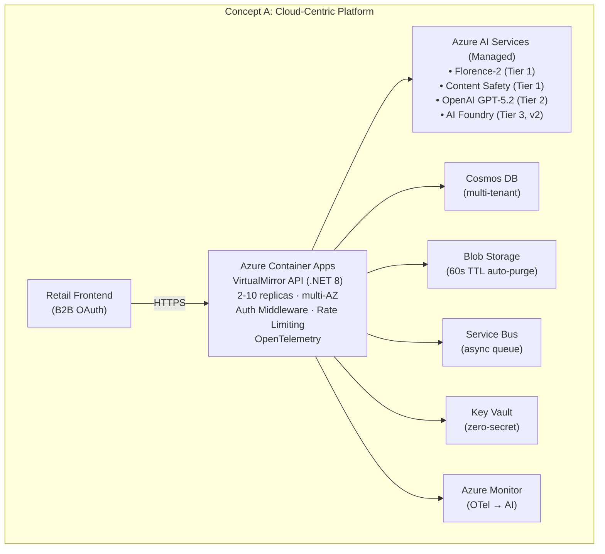

**Tradeoffs**: Maximum managed-service utilization reduces operational burden but creates vendor lock-in to Azure. Single-region v1 limits geographic reach.

### Concept B: Edge + AI Agent-Enabled Operations

**Focus**: Decisioning at the edge, agentic workflows, human-in-the-loop control, latency- and safety-aware patterns.

This concept extends the platform into an **at-home, smartphone-native scenario** where an AI agent assists a privacy-conscious shopper inside the retailer's native mobile app. The smartphone camera captures the photo, **on-device AI performs pose detection and measurement extraction locally**, and only derived measurements are sent to the cloud for fit comparison.

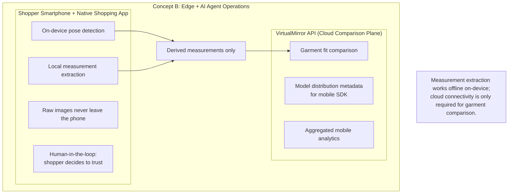

**Agentic AI scenario**: An AI copilot assists the *privacy-conscious home shopper* by synthesizing *on-device body measurements and cloud garment fit data*, flagging *poor fit areas and low-confidence predictions*, and recommending *alternative sizes or garments* — while the **shopper retains accountability** for whether to trust the recommendation and complete the purchase.

**Tradeoffs**: Edge inference requires a native mobile SDK, model distribution to millions of devices, and performance tuning across heterogeneous smartphone hardware. Privacy benefits (local processing) and sub-second measurement extraction offset the added app footprint and mobile-release complexity.

### Concept C: Data Fabric / Intelligence Layer

**Focus**: Unified semantic layer, lineage and governance, AI-ready data products powering decisions across domains.

This concept positions the fit assessment data as part of a **unified retail intelligence layer** that connects shopper insights, garment analytics, and return predictions across the entire retail operation.

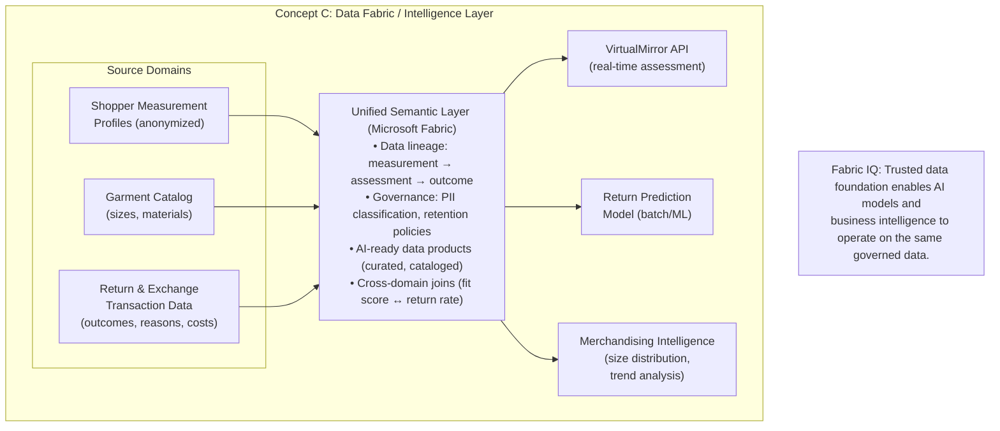

**Tradeoffs**: Requires Microsoft Fabric investment and data engineering effort beyond the fit assessment scope. Maximum long-term value but slower time-to-insight for v1.

---

## Persona-Driven AI Scenarios

### Scenario 1: Online Shopper + AI Fit Assessment (Concept A)

> "An AI copilot that assists the **online shopper** by synthesizing **a single photo and self-reported height into body measurements**, flagging **low-confidence predictions and poor fit areas**, and recommending **the best size with per-area fit breakdown** — while the **shopper retains accountability** for the purchase decision."

| Element | Detail |
|---------|--------|
| **What the AI agent does** | Extracts body measurements from photo; compares against garment data; produces 5-point fit scale per body area |
| **Decisions it supports** | Size selection; whether to purchase or look for alternatives |
| **Human-AI collaboration** | AI provides confidence-scored recommendation; shopper decides whether to trust it or consult size chart |
| **New interfaces** | Fit assessment widget embedded in product page; visual per-area fit overlay |

### Scenario 2: Privacy-Conscious Home Shopper + On-Device AI (Concept B)

> "An AI copilot that assists the **privacy-conscious home shopper** by synthesizing **on-device body measurements and cloud garment fit data**, flagging **poor fit areas and low-confidence predictions**, and recommending **alternative sizes and similar-fit items** — while the **shopper retains accountability** for whether to trust the advice."

| Element | Detail |
|---------|--------|
| **What the AI agent does** | Captures measurements via smartphone camera; extracts them on-device; sends only derived measurements to cloud comparison |
| **Decisions it supports** | Whether to trust the recommendation; whether to retake locally; which size or alternative garment to choose |
| **Human-AI collaboration** | AI provides explainable fit guidance; shopper decides whether to act, retry, or fall back to the size chart |
| **New roles** | "Mobile SDK & Model Distribution Engineer" — owns SDK rollout, model packaging, and device-class performance |

### Scenario 3: Merchandising Analyst + Intelligence Layer (Concept C)

> "An AI copilot that assists the **merchandising analyst** by synthesizing **fit assessment outcomes, return data, and size distribution trends**, flagging **garments with high return-due-to-fit rates**, and recommending **size chart adjustments and inventory rebalancing** — while the **analyst retains accountability** for catalog decisions."

| Element | Detail |
|---------|--------|
| **What the AI agent does** | Correlates fit assessment confidence with actual return outcomes; identifies size chart inaccuracies; models inventory impact |
| **Decisions it supports** | Size chart corrections; garment redesign priorities; inventory allocation across sizes |
| **Human-AI collaboration** | AI surfaces patterns and anomalies; analyst validates against supplier relationships and business constraints |
| **New interfaces** | Merchandising dashboard with fit-informed analytics; automated size chart drift alerts |

---

## C-Suite Relevance — "So What?"

### CIO / VP of Technology

| Concept | Value Proposition |
|---------|-------------------|
| **A. Cloud-Centric Platform** | Modernize the sizing experience with a scalable, API-first AI platform that integrates into any storefront without rebuilding infrastructure. Managed Azure services minimize operational overhead. |
| **B. Edge + AI Agent** | Extend fit intelligence into retailer-owned native mobile apps. On-device inference preserves shopper privacy while reducing cloud dependency for latency-sensitive scenarios. |
| **C. Data Fabric** | Unify fragmented retail data (fit, returns, inventory) into a governed intelligence layer that powers AI models across the entire business — not just one feature. |

### Business / Operations Leader (VP of E-Commerce)

| Concept | Value Proposition |
|---------|-------------------|
| **A. Cloud-Centric Platform** | Reduce return rates by 20–30% ($2–6M annual savings for mid-size retailer). Increase conversion through purchase confidence. Measurable ROI within 6 months. |
| **B. Edge + AI Agent** | Elevate the at-home mobile experience — privacy-conscious shoppers get fit intelligence without uploading body photos, increasing trust and app engagement. |
| **C. Data Fabric** | Turn return data from a cost center into a strategic asset. Fit-informed merchandising decisions reduce overstock and optimize size curve purchasing. |

### Risk / Compliance / Sustainability Leader

| Concept | Value Proposition |
|---------|-------------------|
| **A. Cloud-Centric Platform** | Privacy by design — photos purged in < 60s, opaque identities, DPIA-ready. AI transparency via confidence scores and escalation paths. Audit trail for every assessment. |
| **B. Edge + AI Agent** | Local photo processing on the shopper's smartphone eliminates cloud transmission of body images. Strongest privacy posture. Compliant with strictest data residency requirements. |
| **C. Data Fabric** | Full data lineage from measurement to outcome. PII classification labels. Retention policies enforced at the platform level. Supports regulatory reporting (GDPR Article 30). |

---

## Business Value Driver Mapping

| Value Driver | Technology Capability | Alignment |
|-------------|----------------------|-----------|
| **Decision Velocity & Confidence** | GPT-5.2 native structured output; 5-point fit scale; confidence scoring; < 5s assessment | Shoppers make faster, more confident purchase decisions. Retailers see fewer returns and higher conversion. |
| **Workforce Productivity & Focus** | API-first integration; profile reuse; batch garment ingestion; async queuing | Retail teams onboard faster. Shoppers skip repeat photo uploads, and privacy-conscious buyers can self-serve from their phones without cloud photo transfer. |
| **Operational Resilience & Risk** | Multi-AZ deployment; circuit breakers; graceful degradation; 60s image purge; audit trail | 99.9% availability SLO. Regulatory compliance built-in. AI failures degrade gracefully to size chart fallback. |
| **Growth Enablement & Innovation** | Multi-tenant architecture; v2 custom model path; Data Fabric integration; edge expansion | New retail partners onboard via API. Architecture supports evolution from single feature to retail intelligence platform. |

### IQ Framework Alignment

| IQ Layer | How It Manifests |
|----------|-----------------|
| **Work IQ** | Intelligence embedded in the shopper's daily workflow — fit recommendations appear at the point of purchase decision in both the PDP and the retailer's native shopping app, not in a separate tool. |
| **Foundry IQ** | Azure OpenAI GPT-5.2 Vision and the three-tier AI pipeline create insights (body measurements, fit scores, confidence) from raw inputs (photos, height). Prompt engineering, schema validation, and model versioning enable continuous refinement. |
| **Fabric IQ** | Cosmos DB with hierarchical partition keys, Blob Storage lifecycle policies, and audit trails form the governed data foundation. Concept C extends this into Microsoft Fabric for cross-domain analytics. |

---

## System Context

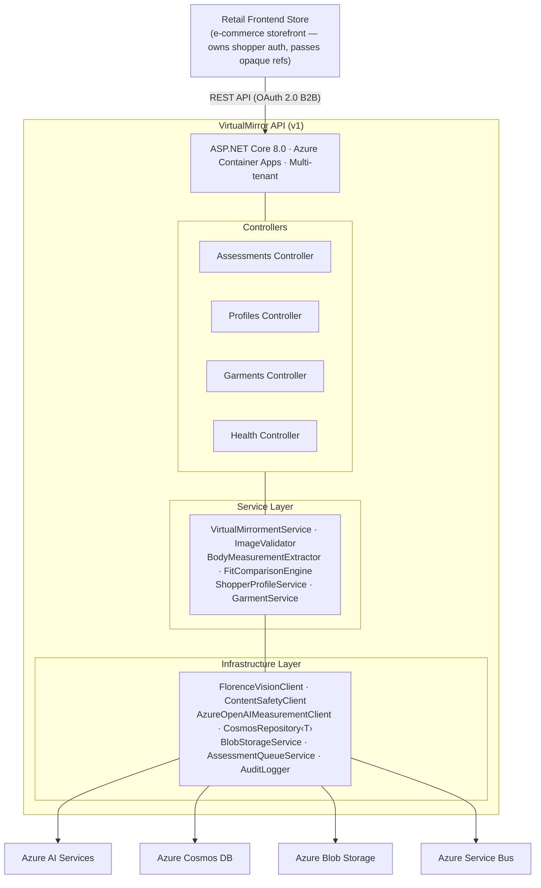

## Three-Tier AI Pipeline (Concept A Detail)

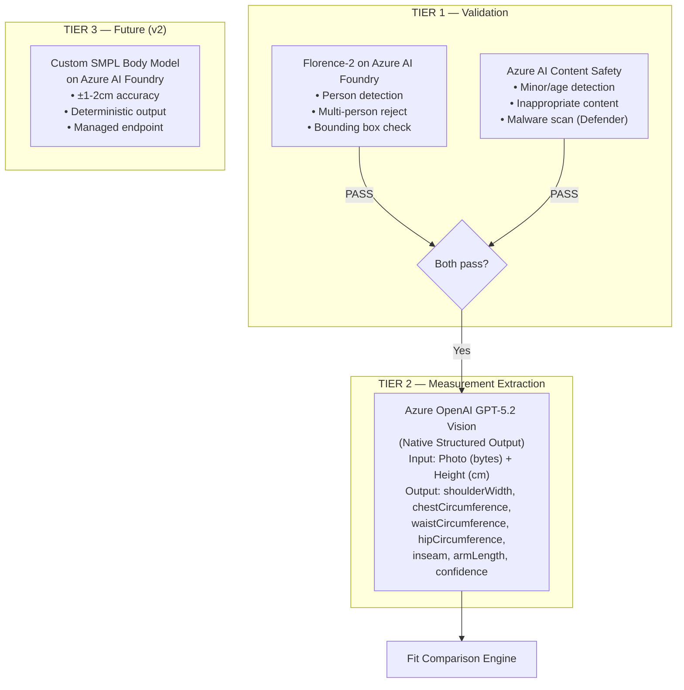

## Fit Comparison Engine

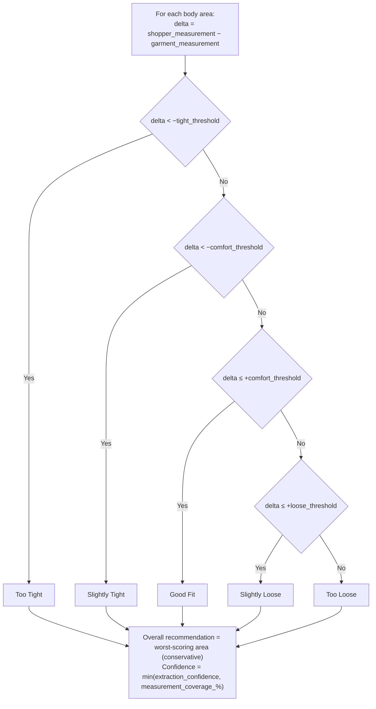

Tolerance bands are configurable per tenant and garment category. System defaults: tight 4 cm, comfort 2 cm, loose 5 cm.

## Azure Service Map

| Service | Purpose | SKU (prod) |
|---------|---------|------------|
| Azure Container Apps | API host (2–10 replicas, multi-AZ) | Consumption |
| Azure Cosmos DB | Multi-tenant document store (hierarchical partition keys) | Autoscale 400–4000 RU/s |
| Azure Blob Storage | Transient image processing (60s TTL auto-purge) | Standard LRS |
| Azure OpenAI | GPT-5.2 Vision for body measurement extraction with JSON schema validation | Standard S0 |
| Azure AI Foundry managed endpoint (Florence-2-large) | Tier 1 person detection, multi-person rejection, bounding box validation | Managed online endpoint |
| Azure AI Content Safety | Minor detection, inappropriate content filter | Standard S0 |
| Azure Service Bus | Async assessment queuing under high load | Standard |
| Microsoft Entra ID | OAuth 2.0 / OIDC (B2B tenant auth + managed identity) | — |
| Azure Key Vault | Secrets, certificates, encryption keys | Standard |
| Azure App Configuration | Feature flags for progressive rollouts | Standard |
| Azure Monitor | OpenTelemetry traces, metrics, logs, alerts | Log Analytics workspace |

## Multi-Tenant Data Architecture

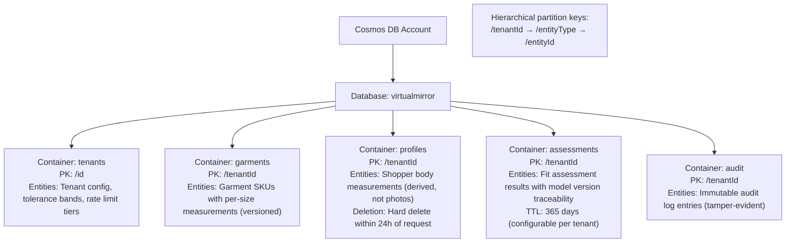

**Isolation guarantee**: Repository base class enforces tenant scoping on every query. Queries without tenant context fail at compile time via generic constraints.

## Assessment Request Flow

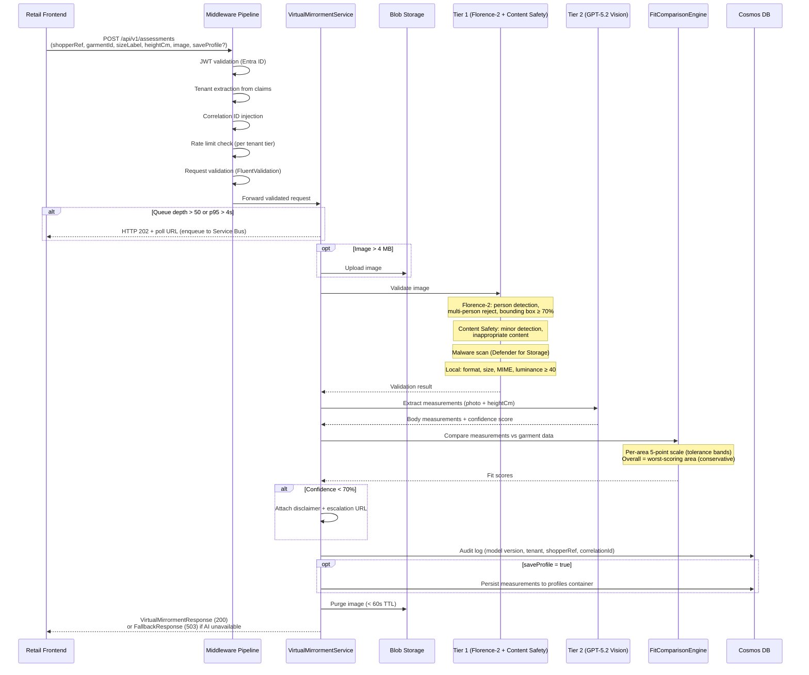

## Network and Security Architecture

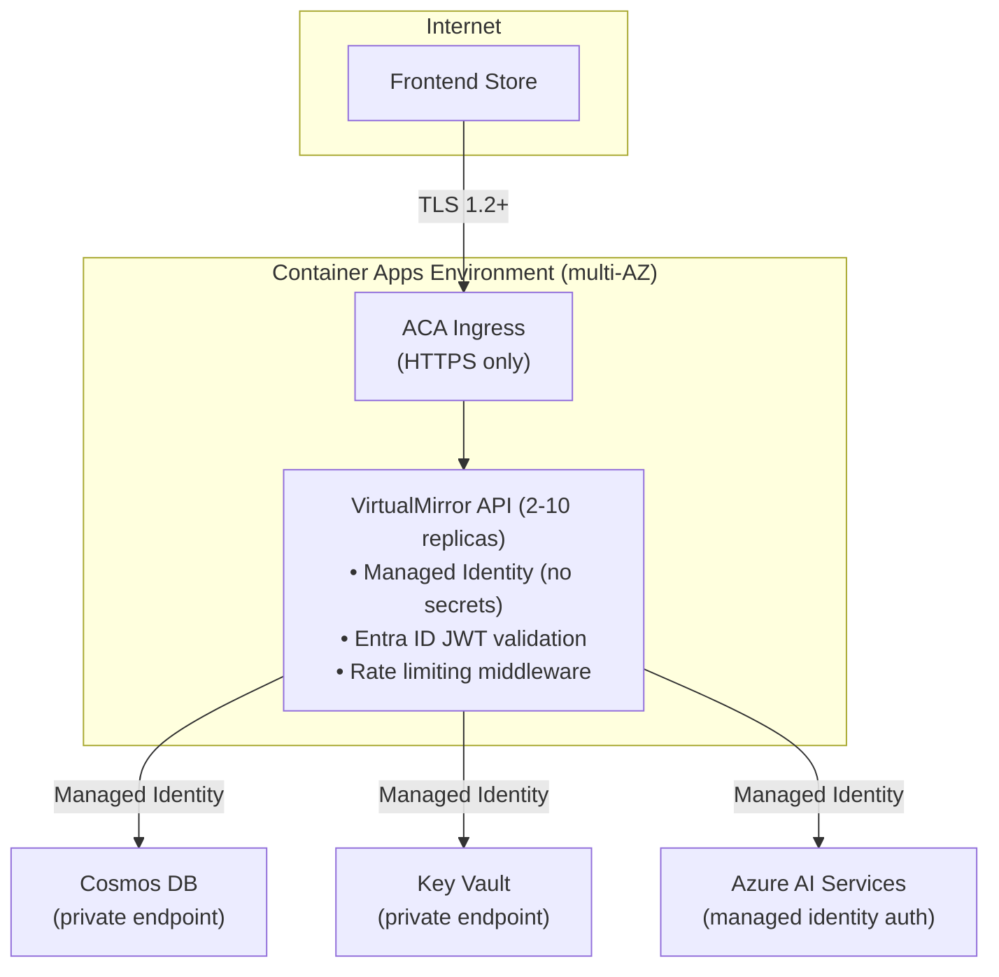

**Zero-trust model**: Every service call authenticated via managed identity. No shared secrets. Private endpoints for data services.

## Threat Model Summary

A full STRIDE/DREAD threat model is maintained separately: **[threat-model.md](./threat-model.md)**

**Overall Risk Rating**: Medium-High (mitigated to Medium by existing controls)

| Category | Threats Identified | Top Risk |
|----------|-------------------|----------|
| Spoofing | 4 | Stolen tenant JWT (DREAD 6.2) |
| Tampering | 5 | Adversarial image perturbation |
| Repudiation | 3 | Shopper disputes recommendation accuracy |
| Information Disclosure | 6 | Body photo exfiltration during 60s processing window (DREAD 5.6) |
| Denial of Service | 5 | API volumetric flood — highest-scoring threat (DREAD 9.0) |
| Elevation of Privilege | 4 | Prompt injection via image metadata |
| AI-Specific | 6 | Bias in measurement extraction across body types (DREAD 5.8) |

**Critical pre-GA actions**: Azure DDoS Protection, Defender for Storage, distributed rate limiting, EXIF metadata stripping, physiological plausibility validation on AI output.

## API Contract Summary

| Endpoint | Method | Purpose | Auth |
|----------|--------|---------|------|
| `/api/v1/assessments` | POST | Create fit assessment from photo | VirtualMirror.Write |
| `/api/v1/assessments/{id}` | GET | Retrieve previous assessment | VirtualMirror.Read |
| `/api/v1/assessments/by-profile` | POST | Assessment from saved profile | VirtualMirror.Write |
| `/api/v1/profiles/{shopperRef}` | GET | Retrieve measurement profile | VirtualMirror.Read |
| `/api/v1/profiles/{shopperRef}` | DELETE | Delete profile (24h fulfillment) | VirtualMirror.Write |
| `/api/v1/garments` | POST | Upsert garment data | VirtualMirror.Write |
| `/api/v1/garments` | GET | List garments (paginated) | VirtualMirror.Read |
| `/api/v1/garments/batch` | POST | Bulk upsert (max 100) | VirtualMirror.Write |
| `/api/v1/health` | GET | Health check | None |

Full contract: [openapi.yaml](../specs/001-clothing-fit-assessment/contracts/openapi.yaml)

## Project Structure

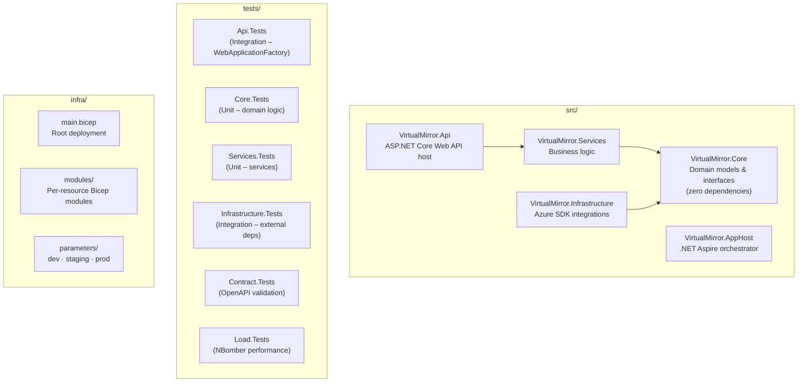

**Architecture pattern**: Clean Architecture (Api → Services → Core ← Infrastructure). Core has zero external dependencies. Infrastructure depends on Core interfaces only.

## Deployment Pipeline

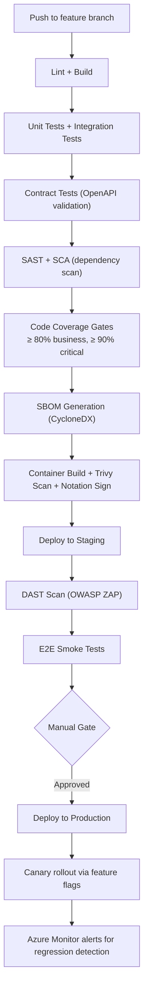

**Environments**: dev → staging → production (identical Bicep, differing only in scale and secrets).

## SLOs and Operational Targets

| Metric | Target | Monitoring |
|--------|--------|------------|
| Availability | 99.9% monthly | Azure Monitor |
| API latency (p95) | < 2 seconds | OpenTelemetry + alerts |
| End-to-end assessment (p95) | < 5 seconds | NBomber validation |
| Concurrent capacity | 500 requests | Auto-scale 2–10 replicas |
| Error rate (5xx) | < 0.1% | Azure Monitor alert |
| Image purge compliance | < 60 seconds | Blob lifecycle + audit |
| Data deletion fulfillment | < 24 hours | Audit log verification |
| RPO | < 1 hour | Cosmos DB continuous backup |
| RTO | < 30 minutes | Multi-AZ failover |

## Key Constraints

- **Single-region v1**: Multi-region deferred; architecture supports future expansion
- **No PII storage**: Service stores measurements only; raw photos purged within 60 seconds
- **Opaque shopper identity**: Frontend owns shopper auth; service receives only hashed reference
- **Mandatory height input**: Required for absolute measurement derivation from 2D photos (100–250 cm)
- **GPT-5.2 accuracy**: ±2–4 cm (under validation, expected improvement with GPT-5.2); v2 custom model targets ±1–2 cm
- **70% confidence threshold**: Below this, system returns disclaimer + escalation URL + size chart fallback

## Key Tradeoffs

Tradeoffs are named explicitly per the workshop quality bar — not hidden behind decisions.

| Tradeoff | Choice Made | What We Gain | What We Accept |
|----------|-------------|-------------|----------------|
| GPT-5.2 Vision vs custom model | GPT-5.2 for v1; custom SMPL for v2 | Rapid time-to-market; no ML team required for v1; same SDK/API shape with native structured output | ±2–4 cm accuracy (under validation, expected improvement with GPT-5.2, vs ±1–2 cm in v2); non-deterministic output |
| Mandatory height input vs reference object | Require shopper-reported height | Reliable scale reference for all measurements | Added UX friction; accuracy depends on self-reported honesty |
| Cloud-only vs edge processing | Cloud-only for v1; on-device smartphone processing for v2 | Simpler v1 architecture; strongest privacy posture and sub-second local extraction in v2 | Native mobile SDK required; device variability; cloud still needed for garment comparison |
| Single-region vs multi-region | Single-region v1 | Lower cost and complexity | Geo-redundancy deferred; higher latency for distant shoppers |
| Middleware rate limiting vs APIM | ASP.NET Core middleware for v1 | No additional infrastructure cost | Per-instance state (not distributed); limited gateway analytics |
| Worst-area scoring vs weighted average | Conservative worst-area approach | Fewer false "good fit" recommendations; builds trust | More "too tight/loose" results; may reduce conversion initially |
| Azure vendor lock-in vs multi-cloud | Azure-native stack (Cosmos, ACA, OpenAI) | Deepest integration; managed identity; unified billing | Migration to other clouds requires significant rework |

## Hypothesis Register

Key assumptions that must be validated during implementation. Per workshop quality bar: every claim labeled as hypothesis or verified.

| ID | Hypothesis | Validation Method | Risk if Wrong |
|----|-----------|-------------------|---------------|
| H1 | GPT-5.2 Vision can extract body measurements within ±2–4 cm using height as scale (under validation, expected improvement with GPT-5.2) | Ground-truth comparison with known measurements (T043b spike) | Core value proposition fails; escalate to Tier 3 or third-party API |
| H2 | 70% confidence threshold balances accuracy vs coverage | A/B testing with shopper feedback and return data | Too high → low coverage; too low → inaccurate recommendations |
| H3 | 4 MB in-memory streaming threshold avoids memory pressure | Load testing at 500 concurrent requests (NBomber) | OOM under load; lower threshold or always use Blob Storage |
| H4 | Tolerance band defaults (tight: 4, comfort: 2, loose: 5 cm) produce meaningful fit ratings | Comparison with industry size charts and garment supplier feedback | Misaligned ratings lead to shopper distrust |
| H5 | Auto-scaling threshold of 50 concurrent HTTP requests is optimal | Load testing with production-like traffic patterns | Under-provisioned → latency spikes; over-provisioned → wasted cost |
| H6 | Image rejection rate stays below 30% (SC-006) | Production monitoring in first 30 days | UX friction; shoppers abandon the feature |
