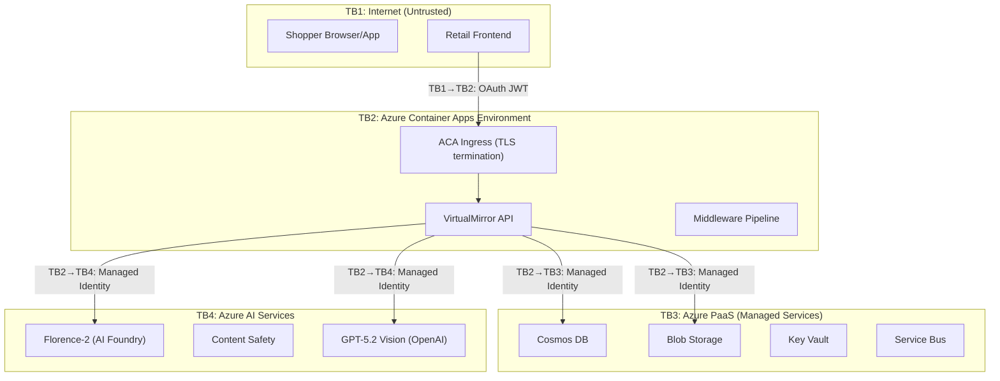
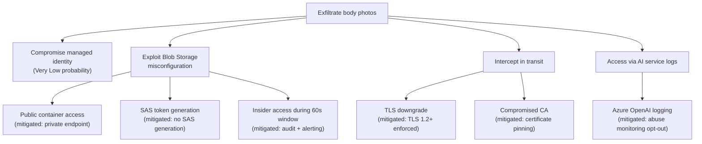
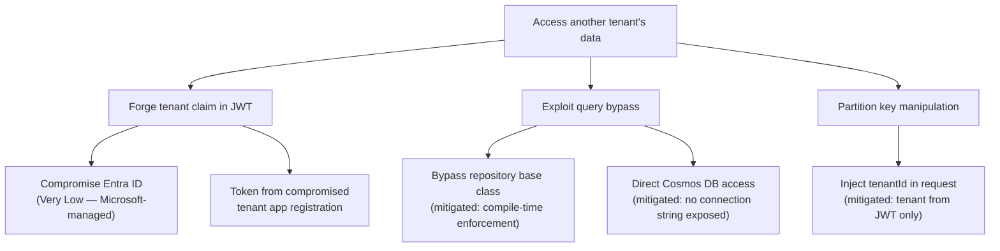
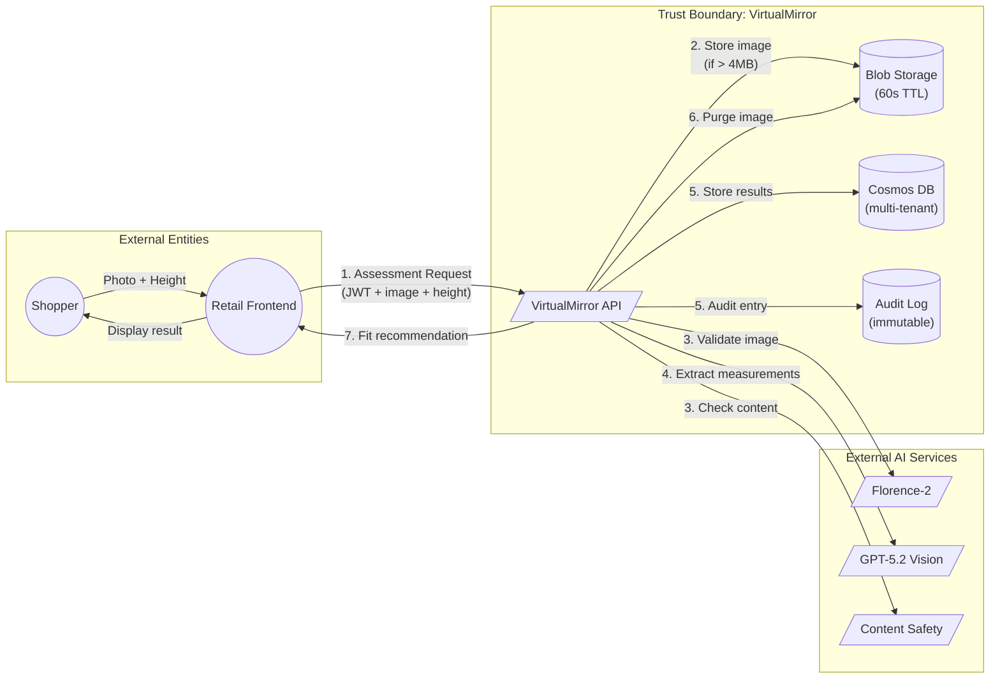

# Threat Model: VirtualMirror AI Clothing Fit Assessment

**Version**: 1.0.0 | **Date**: 2026-05-14 | **Methodology**: STRIDE + DREAD | **Status**: Initial Assessment

---

## Executive Summary

This threat model assesses the VirtualMirror service — a multi-tenant AI-powered clothing fit assessment API deployed on Azure. The system processes body photos, extracts measurements via a three-tier AI pipeline (Florence-2 → GPT-5.2 Vision → Fit Engine), and returns fit recommendations. Given the biometric-adjacent nature of the data and multi-tenant B2B architecture, the threat surface is significant.

**Overall Risk Rating**: **Medium-High** (mitigated to Medium by existing controls)

**Key Risk Areas**:
1. Body image data in transit (biometric-adjacent)
2. AI model manipulation (prompt injection, adversarial inputs)
3. Multi-tenant data isolation failures
4. Supply chain attacks on AI model endpoints

---

## System Decomposition

### Trust Boundaries

### Data Flow Summary

| Data Element | Classification | Flow Path | Retention |
|-------------|---------------|-----------|-----------|
| Body photo (JPEG/PNG) | **Biometric-adjacent / Sensitive** | Frontend → API → Blob → AI → Purge | < 60 seconds |
| Height input | PII (health-adjacent) | Frontend → API → GPT-5.2 | Not stored separately |
| Body measurements | PII (derived biometric) | GPT-5.2 → API → Cosmos DB | Profile: until deletion; Assessment: 365d TTL |
| Fit recommendation | Non-sensitive | API → Frontend | 365d TTL |
| Tenant config | Business confidential | Key Vault → API | Persistent |
| Audit logs | Compliance data | API → Cosmos DB (audit container) | Immutable; retention per policy |

### Entry Points

| ID | Entry Point | Trust Level | Protocol |
|----|------------|-------------|----------|
| EP-1 | `/api/v1/assessments` POST | Authenticated (B2B OAuth) | HTTPS/TLS 1.2+ |
| EP-2 | `/api/v1/profiles/{ref}` GET/DELETE | Authenticated | HTTPS/TLS 1.2+ |
| EP-3 | `/api/v1/garments` POST | Authenticated | HTTPS/TLS 1.2+ |
| EP-4 | `/api/v1/garments/batch` POST | Authenticated | HTTPS/TLS 1.2+ |
| EP-5 | `/api/v1/health` GET | Unauthenticated | HTTPS/TLS 1.2+ |
| EP-6 | Service Bus queue consumer | Internal (managed identity) | AMQP/TLS |

---

## STRIDE Threat Analysis

### S — Spoofing

| ID | Threat | Target | Likelihood | Impact | Risk | Mitigation |
|----|--------|--------|------------|--------|------|-----------|
| S-1 | Stolen/leaked tenant JWT used to call API | EP-1 through EP-4 | Medium | High | **High** | Short-lived tokens (< 1h); Entra ID conditional access; IP allowlisting per tenant; token revocation via Entra |
| S-2 | Tenant A impersonates Tenant B by forging tenant claim | Middleware | Low | Critical | **Medium** | Tenant extracted from validated JWT issuer claim, not request body; Entra ID app registration per tenant |
| S-3 | Compromised managed identity credential | TB2→TB3, TB2→TB4 | Very Low | Critical | **Low** | Managed identities have no exportable credentials; Azure rotates automatically; RBAC least-privilege |
| S-4 | Replay of valid assessment request | EP-1 | Medium | Low | **Low** | Idempotency key in request; correlation ID tracking; no financial side effects from replay |

### T — Tampering

| ID | Threat | Target | Likelihood | Impact | Risk | Mitigation |
|----|--------|--------|------------|--------|------|-----------|
| T-1 | Modified image payload (adversarial perturbation to fool Florence-2/GPT-5.2) | AI Pipeline | Medium | Medium | **Medium** | Multi-tier validation (Florence-2 + Content Safety + GPT-5.2 confidence scoring); reject low-confidence results |
| T-2 | Tampered height input to manipulate measurements | EP-1 request body | High | Medium | **Medium** | Reasonable range validation (100–250 cm); statistical outlier detection against profile history; confidence scoring |
| T-3 | Modified garment measurement data (supply chain attack on catalog) | EP-3, EP-4 | Low | High | **Medium** | Audit trail on all garment writes; versioned documents; change detection alerts; batch validation rules |
| T-4 | Tampered audit log entries | Cosmos audit container | Very Low | Critical | **Low** | Immutable audit container (append-only); tamper-evident hashing; no delete permissions granted to any identity |
| T-5 | Man-in-the-middle on AI service calls | TB2→TB4 | Very Low | High | **Low** | All calls over TLS; managed identity auth; private endpoints (recommended upgrade) |

### R — Repudiation

| ID | Threat | Target | Likelihood | Impact | Risk | Mitigation |
|----|--------|--------|------------|--------|------|-----------|
| R-1 | Tenant denies making assessment request (dispute over billing/usage) | Assessment flow | Medium | Medium | **Medium** | Immutable audit log with correlation ID, tenant ID, timestamp, model version; JWT claims recorded |
| R-2 | Shopper disputes recommendation accuracy (liability) | Fit results | Medium | High | **Medium** | Model version traceability per assessment; confidence score recorded; disclaimer for < 70% confidence; "AI recommends, human decides" framing |
| R-3 | Claim that photos were retained beyond 60s | Data retention | Low | High | **Medium** | Blob lifecycle policy auto-purge; audit log of purge events; compliance monitoring dashboard |

### I — Information Disclosure

| ID | Threat | Target | Likelihood | Impact | Risk | Mitigation |
|----|--------|--------|------------|--------|------|-----------|
| I-1 | **Body photo exfiltration during processing window** | Blob Storage (0–60s) | Low | **Critical** | **High** | 60s TTL auto-purge; Defender for Storage; private endpoint; managed identity only access; no SAS token generation; monitoring for unusual read patterns |
| I-2 | Cross-tenant data leakage (Tenant A reads Tenant B's profiles) | Cosmos DB queries | Low | Critical | **Medium** | Repository base class enforces tenant scoping at compile time; hierarchical partition keys include tenantId; integration tests verify isolation |
| I-3 | Body measurements exposed in logs/telemetry | Azure Monitor / OTel | Medium | High | **Medium** | PII scrubbing in telemetry pipeline; measurements excluded from structured logging; only correlation IDs and metadata in traces |
| I-4 | AI service logs retain photo data | Azure OpenAI / AI Foundry | Low | High | **Medium** | Azure OpenAI abuse monitoring opt-out (where eligible); data processing agreement; no training on customer data (Azure policy) |
| I-5 | Error responses leak internal architecture details | API responses | Medium | Low | **Low** | Global exception handler returns generic error codes; detailed errors only in 500-level internal logs; ProblemDetails without stack traces |
| I-6 | Health endpoint exposes version/dependency information | EP-5 | Low | Low | **Low** | Health check returns only "Healthy"/"Degraded"/"Unhealthy"; no version or dependency details exposed publicly |

### D — Denial of Service

| ID | Threat | Target | Likelihood | Impact | Risk | Mitigation |
|----|--------|--------|------------|--------|------|-----------|
| D-1 | Volumetric API flood exhausting Container Apps replicas | EP-1 | High | High | **High** | Rate limiting per tenant tier; auto-scale 2–10 replicas; Service Bus overflow queue (HTTP 202 when depth > 50); Azure DDoS Protection |
| D-2 | Large image uploads consuming memory/bandwidth | EP-1 | High | Medium | **Medium** | 4 MB max image size; streaming to Blob for oversized payloads; request size limits at ingress |
| D-3 | AI service quota exhaustion (GPT-5.2 tokens per minute) | Azure OpenAI | Medium | High | **Medium** | Token budget per tenant; circuit breaker pattern; graceful degradation to size chart fallback (HTTP 503 with fallback) |
| D-4 | Cosmos DB RU exhaustion via expensive queries | Data layer | Medium | Medium | **Medium** | Autoscale 400–4000 RU/s; partition key design prevents cross-partition queries; per-tenant usage tracking |
| D-5 | Blob Storage abuse (repeated large uploads without completing assessment) | Blob Storage | Medium | Low | **Low** | 60s TTL auto-purge regardless of assessment completion; blob count monitoring; per-tenant upload rate limiting |

### E — Elevation of Privilege

| ID | Threat | Target | Likelihood | Impact | Risk | Mitigation |
|----|--------|--------|------------|--------|------|-----------|
| E-1 | Tenant escalates from Read to Write scope via token manipulation | RBAC system | Low | High | **Medium** | Scopes validated from Entra ID token claims (server-side); no client-side scope decisions; separate app registrations per permission level |
| E-2 | Container escape from ACA to access adjacent workloads | Azure Container Apps | Very Low | Critical | **Low** | ACA is a managed PaaS (no direct node access); Hyper-V isolation; network segmentation; no shared container apps environment with other workloads |
| E-3 | Prompt injection via image metadata to manipulate GPT-5.2 output | AI Pipeline | Medium | Medium | **Medium** | Image metadata stripped before AI processing; structured output with JSON schema validation (GPT-5.2 native); output range validation on measurements |
| E-4 | Compromised dependency in container image | Supply chain | Low | Critical | **Medium** | SBOM generation (CycloneDX); Trivy scan in CI/CD; Notation signing; SCA dependency scanning; base image pinning |

---

## AI-Specific Threats

Given the centrality of AI to this system, additional AI-specific threats warrant separate analysis:

| ID | Threat | Description | Likelihood | Impact | Mitigation |
|----|--------|-------------|------------|--------|-----------|
| AI-1 | **Adversarial image attacks** | Crafted images that pass Florence-2 validation but produce incorrect GPT-5.2 measurements | Medium | High | Multi-tier validation; confidence thresholds; statistical outlier detection against known body proportions |
| AI-2 | **Prompt injection via image** | Embedding text instructions in the image that GPT-5.2 interprets as system commands | Medium | Medium | System prompt hardening; structured output schema constrains response format; output range validation (measurements must be physiologically plausible) |
| AI-3 | **Model poisoning (supply chain)** | Compromised Florence-2 or GPT-5.2 model weights producing systematically wrong results | Very Low | Critical | Azure-managed model hosting; Microsoft responsible for model integrity; version pinning; drift detection via ground-truth benchmarks |
| AI-4 | **Bias in measurement extraction** | GPT-5.2 may perform inconsistently across different body types, skin tones, or clothing | Medium | High | Diverse test dataset in validation; per-demographic accuracy monitoring; bias detection in production metrics; escalation to human review |
| AI-5 | **Hallucinated measurements** | GPT-5.2 generates plausible but incorrect body measurements with high confidence | Medium | High | Physiological plausibility checks (e.g., waist < chest for adults); cross-measurement consistency validation; confidence calibration |
| AI-6 | **Data leakage through model memorization** | GPT-5.2 retains information from processed photos across sessions | Very Low | High | Azure OpenAI data processing agreement (no training on customer data); stateless inference; session isolation guaranteed by Azure |

---

## DREAD Risk Scoring (Top Threats)

| Threat | Damage | Reproducibility | Exploitability | Affected Users | Discoverability | **Score** |
|--------|--------|-----------------|----------------|---------------|-----------------|-----------|
| I-1: Photo exfiltration | 10 | 4 | 3 | 8 | 3 | **5.6** |
| D-1: API flood | 6 | 10 | 9 | 10 | 10 | **9.0** |
| S-1: Stolen JWT | 8 | 7 | 5 | 6 | 5 | **6.2** |
| AI-1: Adversarial images | 7 | 5 | 5 | 4 | 4 | **5.0** |
| AI-4: Bias | 7 | 8 | 3 | 8 | 3 | **5.8** |
| E-3: Prompt injection | 6 | 6 | 5 | 4 | 5 | **5.2** |
| I-2: Cross-tenant leakage | 10 | 3 | 3 | 6 | 3 | **5.0** |

---

## Attack Trees (Critical Paths)

### Attack Tree 1: Body Photo Exfiltration

### Attack Tree 2: Cross-Tenant Data Access

---

## Existing Controls Assessment

| Control | Effectiveness | Gap |
|---------|--------------|-----|
| Entra ID OAuth 2.0 (B2B) | ✅ Strong | Consider conditional access policies per tenant |
| Managed Identity (zero secrets) | ✅ Strong | No gaps identified |
| TLS 1.2+ everywhere | ✅ Strong | Confirm TLS 1.3 preferred where supported |
| 60s image auto-purge | ✅ Strong | Add monitoring alert if purge exceeds 60s |
| Rate limiting (per-tenant) | ⚠️ Adequate | Middleware is per-instance; not distributed. Consider Redis-backed or APIM for v2 |
| Content Safety filter | ✅ Strong | Covers minor detection and inappropriate content |
| Hierarchical partition keys | ✅ Strong | Compile-time tenant enforcement is excellent |
| Immutable audit log | ✅ Strong | Consider tamper-evident hashing (Merkle tree) |
| SBOM + Trivy + Notation | ✅ Strong | Add runtime container scanning (Defender for Containers) |
| Confidence threshold (70%) | ⚠️ Adequate | Calibration needed; adversarial inputs may game confidence |

---

## Recommended Security Enhancements

### Priority 1 — Critical (Implement Before GA)

| # | Recommendation | Addresses | Effort |
|---|---------------|-----------|--------|
| 1 | **Add Azure DDoS Protection Standard** to the Container Apps environment | D-1 | Low |
| 2 | **Enable Defender for Storage** with malware scanning on the Blob container | I-1, T-1 | Low |
| 3 | **Implement distributed rate limiting** (Redis or Azure API Management) to replace per-instance middleware | D-1, D-3 | Medium |
| 4 | **Strip all image metadata** (EXIF, XMP, IPTC) before passing to AI services | E-3, AI-2 | Low |
| 5 | **Add physiological plausibility validation** on GPT-5.2 output (e.g., waist < hip, arm length proportional to height) | AI-5, T-2 | Medium |

### Priority 2 — High (Implement Within 30 Days of GA)

| # | Recommendation | Addresses | Effort |
|---|---------------|-----------|--------|
| 6 | **Enable private endpoints** for Azure OpenAI and AI Foundry managed endpoints | T-5, I-4 | Medium |
| 7 | **Implement tenant IP allowlisting** as optional security layer | S-1 | Low |
| 8 | **Add bias monitoring pipeline** — track accuracy metrics per demographic segment | AI-4 | High |
| 9 | **Image purge compliance monitor** — alert if any blob exists > 60s | I-1, R-3 | Low |
| 10 | **Request signing** (HMAC) for garment batch uploads to detect supply chain tampering | T-3 | Medium |

### Priority 3 — Medium (v2 Roadmap)

| # | Recommendation | Addresses | Effort |
|---|---------------|-----------|--------|
| 11 | Migrate to Azure API Management for centralized security policy enforcement | D-1, S-1 | High |
| 12 | Implement Confidential Computing for photo processing (TEE enclaves) | I-1 | High |
| 13 | Add adversarial input detection model (pre-filter before Florence-2) | AI-1, T-1 | High |
| 14 | Implement mutual TLS (mTLS) for tenant-to-API communication | S-1, T-5 | Medium |
| 15 | Deploy canary tokens in Cosmos DB to detect unauthorized data access | I-2 | Low |

---

## Compliance & Regulatory Considerations

| Regulation | Applicability | Key Requirements | Current Posture |
|-----------|--------------|-----------------|-----------------|
| **GDPR** | EU shoppers (Walmart international) | Right to erasure; data minimization; DPIA required for biometric-adjacent processing | ✅ 24h deletion; 60s photo purge; opaque IDs; measurements only |
| **CCPA/CPRA** | California shoppers | Right to delete; no sale of biometric info; opt-out of AI profiling | ✅ Deletion API; no data sharing; no profiling beyond fit |
| **EU AI Act** | EU market presence | High-risk AI system classification (biometric-adjacent); explainability; human oversight | ⚠️ Likely "limited risk" (not biometric identification); confidence scores provide transparency; needs formal classification |
| **Illinois BIPA** | Illinois shoppers | Written consent before biometric collection; no profit from biometric data | ⚠️ Measurements are *derived*, not direct biometrics — legal classification uncertain; recommend explicit consent flow |
| **PCI DSS** | If integrated with payment | Cardholder data protection | ✅ N/A — no payment data processed |
| **SOC 2 Type II** | B2B tenant requirements | Security, availability, processing integrity, confidentiality, privacy | ⚠️ Azure provides platform SOC 2; application-level audit needed |

---

## Data Flow Diagram (DFD) — Level 1

---

## Incident Response Considerations

| Scenario | Detection | Response | Recovery |
|----------|-----------|----------|----------|
| Photo purge failure (blob > 60s) | Blob lifecycle monitoring + alert | Immediate manual purge; incident ticket; notify affected tenant | Verify all blobs purged; root cause analysis |
| Cross-tenant data access | Anomalous query pattern detection; audit log review | Isolate affected tenant; revoke credentials; forensic analysis | Data breach notification per regulation; remediation |
| AI model producing dangerous outputs | Confidence score drift detection; output range violations | Circuit breaker → fallback mode; disable AI pipeline | Model rollback to last known-good version; re-validate |
| DDoS attack | Azure DDoS Protection alerts; latency spike detection | Auto-scale; aggressive rate limiting; geo-blocking if needed | Post-mortem; update rate limits; consider WAF |
| Compromised tenant credentials | Unusual access patterns; geographic anomaly | Revoke JWT; disable tenant; notify tenant admin | Credential rotation; access review; forensic audit |

---

## Review Cadence

| Activity | Frequency | Owner |
|----------|-----------|-------|
| Threat model review | Quarterly | Security Architect |
| Penetration testing | Bi-annually | External vendor + internal red team |
| AI model bias audit | Monthly | ML Engineering + Ethics board |
| Dependency vulnerability scan | Every CI/CD run | Automated (Trivy + SCA) |
| Access review (managed identities & RBAC) | Quarterly | Platform Engineering |
| Compliance posture assessment | Annually | Legal + Compliance |
| Incident response drill | Bi-annually | SRE + Security |

---

## Appendix: Assumptions

1. Azure managed services (Cosmos DB, Blob Storage, OpenAI) maintain their published security SLAs
2. Entra ID token validation is correctly implemented using Microsoft.Identity.Web middleware
3. All inter-service communication uses managed identity (no shared secrets or connection strings)
4. The 60s TTL on Blob Storage is enforced by Azure lifecycle management (not application code alone)
5. GPT-5.2 on Azure OpenAI does not retain or train on customer input data per Azure data processing agreement
6. Retail frontend partners implement their own shopper authentication; VirtualMirror receives only opaque references

---

*Document prepared using STRIDE methodology with DREAD scoring. Aligned with OWASP Threat Modeling guidelines and Microsoft SDL practices.*
